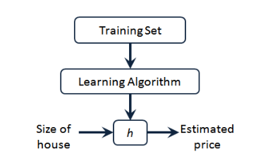

# Linear Regression

## One Variable
### 模型表示 Model Representation
训练集  **Training Set**

**Notation:**
$m$:训练集种实例的数量
$x$：特征/输入变量
$y$：目标变量/输出变量
$(x, y)$：训练集种的实例
$(x^{i}, y^{i})$：第i个观察实例
$h$：学习算法的解决方法/函数（假设**hypothesis**）

如何表达$h \rightarro h_{\theta}(x) = \theta_0+\theta_1 x$

### 代价函数 Cost function

How to choose $\theta_i 's$?

代价函数￥

