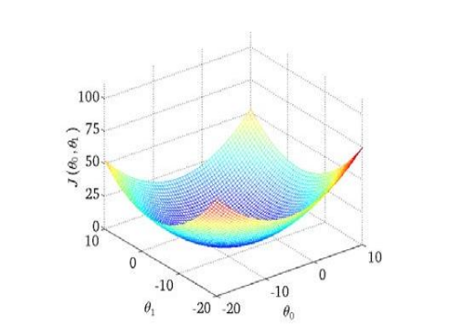
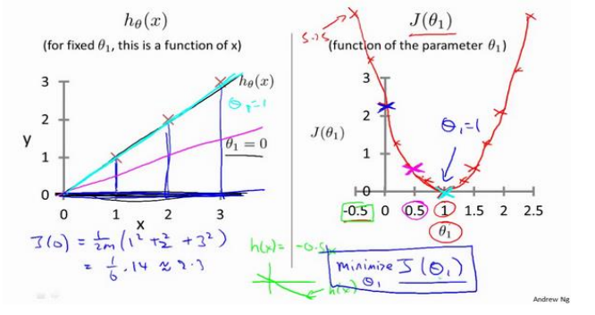
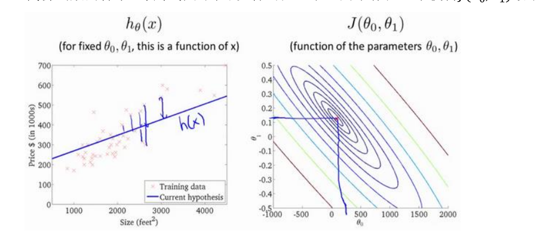
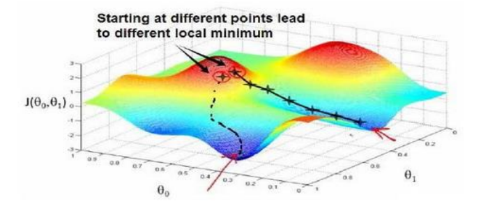
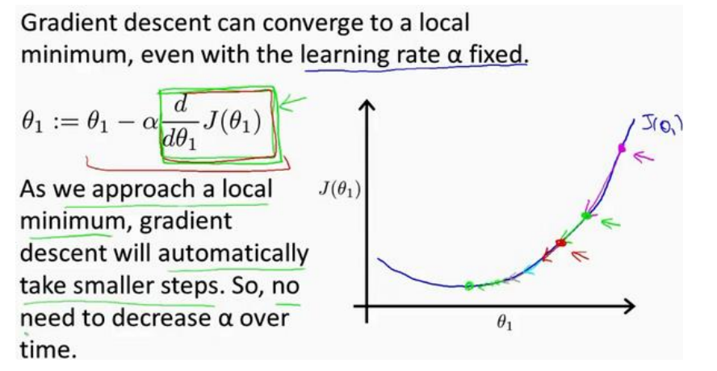

# 线性回归 Linear Regression

## 单变量 One Variable
### 模型表示 Model Representation
训练集  **Training Set**

**Notation:**
$m$:训练集种实例的数量
$x$：特征/输入变量
$y$：目标变量/输出变量
$(x, y)$：训练集种的实例
$(x^{i}, y^{i})$：第i个观察实例
$h$：学习算法的解决方法/函数（假设**hypothesis**）

如何表达$h \rightarrow h_{\theta}(x) = \theta_0+\theta_1 x$

### 代价函数 Cost function

How to choose $\theta_i 's$?

代价函数$J(\theta_0, \theta_1)=\displaystyle \frac{1}{2m}\displaystyle \sum^{m}_{i=1}(h_{\theta}(x^{(i)})-y^{(i)})^2$
让代价函数最小！平方误差函数

#### Intuition I - 坐标系

**Hypothesis：**
$h_{\theta}(x) = \theta_0+\theta_1 x$

**Parameter：**
$\theta_0, \theta_1$

**Cost Function：**
$J(\theta_0, \theta_1)=\displaystyle \frac{1}{2m}\displaystyle \sum^{m}_{i=1}(h_{\theta}(x^{(i)})-y^{(i)})^2$

**Goal：**
$\underset{\theta_0, \theta_1} {minimize} \; J(\theta_0, \theta_1)$

#### Intuition II - 等高线

### 梯度下降 Gradient Descent

随机选择一个参数的组合$(\theta_0, \theta_1, \cdots, \theta_n)$
然后寻找下一个能让代价函数值下降最多的参数组合，直到一个局部最小值 **local minimum**
不同的初始参数组合可能会得到不同的局部最小值

批量梯度下降的算法：

$
repeat\; until \;converge\;\{\\
\quad\theta_j :=\theta_j - \alpha\displaystyle{\frac{\partial}{\partial \theta_j}}J(\theta_0, \theta_1)\; (for \; j=0 \; and \; j=1)\\
\}
$

$\alpha$ 学习率 **learning rate** 

#### simultaneously update
$
\{\\
\quad    temp0\,:=\theta_0 - \alpha\displaystyle{\frac{\partial}{\partial \theta_0}}J(\theta_0, \theta_1)\; (for \; j=0 \; and \; j=1)\\
\quad    temp1\,:=\theta_1 - \alpha\displaystyle{\frac{\partial}{\partial \theta_1}}J(\theta_0, \theta_1)\; (for \; j=0 \; and \; j=1)\\
\quad    \theta_0\,:=temp0\\
\quad    \theta_1\,:=temp1\\
\}
$

#### Intuition 

$\alpha$ 学习率 learning rate

太小，挪动太慢
太大，直接越过最低点，甚至无法收敛

如果$\theta_1$直接在一个局部最低点，不会更新

不需要每次更新$\alpha$的值，因为导数值会不断减小

### 梯度下降的线性规划

如何利用梯度下降法，关键是求导！

$
\displaystyle{\frac{\partial}{\partial \theta_j}J(\theta_0, \theta_1)} = \displaystyle{\frac{\partial}{\partial \theta_j}}\displaystyle\frac{1}{2m}\displaystyle\sum^{m}_{i=1}(h_{\theta}(x^{(i)})-y^{(i)})^2\\
j=0\quad\displaystyle{\frac{\partial}{\partial \theta_0}J(\theta_0, \theta_1)} =\displaystyle\frac{1}{m}\displaystyle\sum^{m}_{i=1}(h_{\theta}(x^{(i)})-y^{(i)})\\
j=1\quad\displaystyle{\frac{\partial}{\partial \theta_1}J(\theta_0, \theta_1)} =\displaystyle\frac{1}{m}\displaystyle\sum^{m}_{i=1}((h_{\theta}(x^{(i)})-y^{(i)})\cdot x^{(i)})
$

算法：
$
repeat\; until \;converge\;\{\\
\theta_0\;:=\;\theta_0 - \alpha\displaystyle\frac{1}{m}\displaystyle\sum^{m}_{i=1}(h_{\theta}(x^{(i)})-y^{(i)})\\
\theta_1\;:=\;\theta_1 - \alpha\displaystyle\frac{1}{m}\displaystyle\sum^{m}_{i=1}((h_{\theta}(x^{(i)})-y^{(i)})\cdot x^{(i)})\\
\}
$

**批量梯度下降**：每一步梯度下降都用到了所有的训练样本

### 线性代数回顾 Linear Algebra Review
略

## 多变量 Multiple Variables

### 多维特征