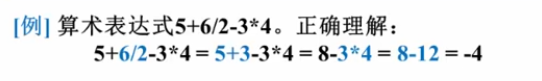
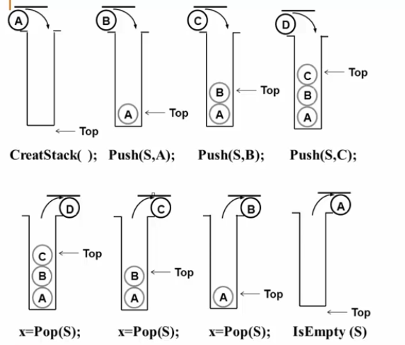

# 堆栈

表达式求值，递归，函数调用


表达式求值：不同运算符号优先级不一样



后缀表达式：运算符号位于两个运算数之后， $a\ b\ c*\ +d\ e /\ -$

中缀表达式：运算符号位于两个运算数之中， $a + b * c - d / e$


后缀表达式求值策略：从左往右扫描，逐个处理运算数和运算符号

1. 遇到运算数？记住目前不参与运算的数

2. 遇到运算符号？最近的两个运算数进行运算

**这个时候就需要利用栈，顺序存储，倒序输出** 

### 
抽象数据类型描述

**堆栈Stack** ：具有一定操作约束的线性表

只能在栈顶Top做插入和删除

1. 插入数据 入栈Push

2. 删除数据 出栈Pop

3. 先入后出LIFO

```c
类型名称：堆栈Stack

数据对象集：一个有0个或多个元素的有穷线性表

操作集：长度为MaxSize的堆栈S属于Stack，堆栈元素item属于ElementType

1.Stack CreateStack(int MaxSize)：新建一个空的栈，最大长度为MaxSize
2.int IsFull(Stack S, int MaxSize)：判断栈堆S是否已经满了
3.**void Push(Stack S, ElementType item)：将元素item压入栈堆** 
4.int IsEmpty(Stack S)：判断栈堆S是否为空
5.**ElementType Pop(Stack S)：删除并返回栈顶元素** 
```


Push Pop可以穿插交替进行




### 
堆栈的顺序存储实现

**一位数组** 和一个记录当前**栈顶** 元素位置的变量组成

```C
#define MaxSize<存储数据元素的最大个数>
typedef struct SNode * Stack;
struct SNode
{
  ElementType Data[MaxSize];
  int Top;
} ;
```


入栈Push

```c
void Push(Stack PtrS, ElementType item)
{
  if(Ptrs->Top == MaxSize-1)
    printf("The Stack is Full.");
  else
    PtrS->Data[++(Ptr->Top)] = item;
} 
```


出栈Pop

```C
ElementType Pop(Stack PtrS)
{
  if(PtrS->Top == -1)
    printf("The Stack is Empty.");
  else
    return PtrS->Data[(PtrS->Top)--];
} 
```


例：用一个数组实现两个堆栈，要求最大地利用数组空间，使数组只要有空间入栈就可以成功


分析：一个数组，从两头开始向中间生长，两个栈顶的指针相遇，表示两个栈都满了

```c
#define MaxSize <存储数据元素的最大个数>
struct DStack
{
  ElementType Data[MaxSize];
  int Top1;
  int Top2;
}S;

S.Top1 = -1;
S.Top2 = MaxSize;

 void Push(struct DStack *PtrS, ElementType item, int Tag)
 {
   **/* Tag作为区分两个堆栈的标志，取值 1 or 2 */** 
   if(PtrS->Top2 - PtrS->Top1 == 1)
     printf("The Stack is Full.");
   if(Tag == 1)
     PtrS->Data[++(PtrS->Top1)] = item;
   if(Tag == 2)
     PtrS->Data[--(PtrS->Top2)] = item;
 } 
 
 ElementType Pop(struct DStack *PtrS, int Tag)
 {
   if(Tag == 1)
   {
     if(PtrS->Top1 == -1)
     {
       printf("The Stack is Empty.");
       return NULL;
     }else
     {
       return PtrS->Data[(PtrS->Top1)--];
     }
   }else
   {
     if(PtrS->Top2 == MaxSize)
     {
       printf("The Stack is Empty.");
       return NULL;
     }else
     {
       return PtrS->Data[(PtrS->Top2)++];
     }
   }
 }
```


### 
堆栈的链式存储实现

单向链表，也叫链栈，插入和删除只能在链栈的栈顶进行

Top在哪一头？head方便插入和删除，tail不方便删除

```c
typedef struct SNode * Stack
struct SNode
{
  ElementType Data;
  struct SNode * Next;
} ;
```


创建一个链栈，S表示头指针，指向第一个元素，本身没有值

```c
Stack CreateStack()
{
  /* 生成一个头节点，返回指针 */
  Stack S;
  S = (Stack)malloc(sizeof(Struct Node));
  S->Next = NULL;
  return S;
} 
```


```c
int IsEmpty(Stack S)
{
  return (S->Next == NULL);
} 
```


```c
void Push(ElementType item, Stack S)
{
  struct SNode * TempCell;
  TempCell = (Stack)malloc(sizeof(struct SNode));
  TempCell->Data = item;
  TempCell->Next = S->Next;
  S->Next = TempCell;
}
 
```


```c
ElementType Pop(Stack S)
{
  struct SNode * FirstCell;
  ElementType TopElement;
  
  if(IsEmpty(S))
    printf("The Stack is Empty");
    return NULL;
  else
    FirstCell = S->Next;
    S->Next = FirstCell->Next;
    TopElem = FirstCell->Data;
    free(FirstCell);
    return TopElem;
} 
```


### 
堆栈的应用：表达式求值

中缀表达式转化成后缀表达式：

从头到尾读取中缀表达式的每个对象，对不同对象不同处理：

1. 运算数：直接输出

2. 左括号：压入栈中

3. 右括号：将栈顶的运算符弹出并输出，直到遇到左括号（出栈，不输出）

4. 运算符：

&ensp;&ensp;&ensp;&ensp;1. 若优先级大于栈顶运算符时，压栈

&ensp;&ensp;&ensp;&ensp;2. 若优先级小于栈顶运算符时，栈顶运算符弹出并输出，再比较新的栈顶运算符，直到该运算符大于栈顶运算符优先级，然后压栈

5. 若各个对象处理完毕，把堆栈中留存的运算符一并输出

