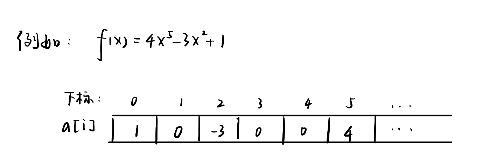
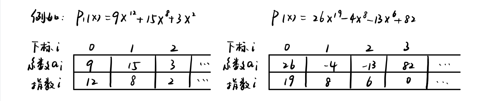
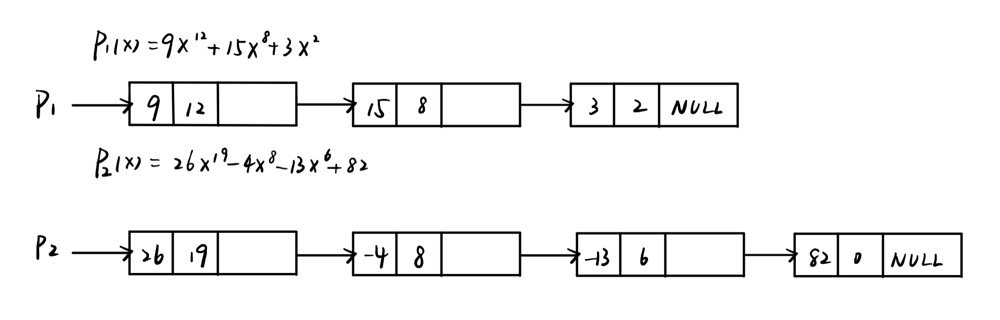

# 线性表

### 
多项式表示

一元多项式： $f(x) = a_0 + a_1 x + \dots + a_{n-1} x ^{n-1} + a_n x^n$

主要运算：加减，相乘etc


如何表示多项式：多项式项数n，各项系数 $a_i$以及指数i


**方法1:顺序储存结构直接表示** 

$$
a[i]:项x_i的系数a_i
$$




多项式相加：两个数组对应的分量相加

但是如果项数过多, $x + 3x^{2000}$，每次需要调用2000大小的数组，浪费资源


**方法2:顺序储存结构表示非零项** 

每个非零项 $a_i x^i$涉及两个信息，系数和指数，可以看成 $(a_i, i)$二元组的集合

所以可以用结构数组表示，按照指数大小有序存储：




多项式相加：从头开始，比较两个多项式对应的项的指数


**方法3:链表结构存储非零项** 

链表中每个节点储存多项式中的非零项，包括**系数coef和指数expon** 两个数据域以及一个指针域**link** 

```C
typedef struct PolyNode * Polynomial
struct PolyNode
{
  int coef;
  int expon;
  Polinomial link;
}
```





### 
什么是线性表？

线性表Linear List，是由同类型数据元素构成有序序列的线性结构

1. 表中元素个数称为线性表的长度

2. 线性表没有元素时，称为空表

3. 表起始位置称为表头，表结束为止称为表尾


用抽象数据类型描述

```C
类型名称：线性表（List）

数据对象集：线性表是n（>=0）个元素构成的有序序列{a1, a2, ..., an}

操作集：线性表L属于List，整数i表示为止，元素X属于ElementType

线性表的主要操作有：
1. List MakeEmpty():初始化一个空的线性表L
2. ElementType FindKth(int K, List L):根据序位K，返回相对应的元素
3. int Find(ElementType X, List L):在线性表L中查找X第一次出现的位置
4. void Insert(ELementType X, int i, List L):在i位序上插于一个新元素X
5. void Delete(int i, List L):删除置顶位序i上的元素
6. int Length(List L):返回线性表的长度n 
```


**线性表的顺序存储实现（利用结构数组）** 

```c
typedef struct LNode * List;
struct LNode
{
  ElementType Data[MAXSIZE];
  int Last;
};
struct LNode L;
List PtrL;

// 访问下标为i的元素：PtrL->Data[i]或者L.Data[i]
// 线性表的长度： PtrL->Last+1或者L.Last+1
```


1.初始化，建立空的顺序表

```c
List MakeEmpty()
{
  List PtrL;
  PtrL = (List)malloc(sizeof(struct LNode));
  PtrL->Last = -1;
  return PtrL
} 
```


2.查找

```c
ElementType FindKth(int K, List PtrL)
{
  while(K <= PtrL->Last && K >=0)
  {
    return PtrL->Data[K];
  }
} 
```


```c
int Find(ElementType X, List PtrL)
{
  int i = 0;
  while(PtrL->Data[i] != X && i <= PtrL->Last)
  {
    i++;
  }
  if(i > PtrL->Last)
    return -1;
  else
    return i;
} 
```


3.插入

```c
void Insert(ElementType X, int i, List PtrL)
{
   int j;
   if(PtrL->Last >= MAXSIZE)
     printf("线性表已满");
   if(i >= PtrL->Last+1 || i <= 0)
     printf("位置不合法");
    for(j = PtrL->Last; j >= i; j--)
    {
      PtrL->Data[j+1] = PtrL->Data[j]; 
    }
    PtrL->Data[i] = X;
    PtrL->Last++; 
} 
```


4.删除

```c
void Delete(int i, List PtrL)
{
  int j;
  if(i >= PtrL->Last+1 || i <= 0)
    printf("位置不合法")
  for(j = i; j <= PtrL->Last; j++)
  {
    PtrL->Data[i] = PtrL->Data[i+1];
  }
  PtrL->Last--;
}

```


**线性表的链式储存实现** 

插入，删除等不需要移动数据元素，只需要修改链

```c
typedef struct LNode * List;
struct LNode
{
  ElementType Data;
  List Next;
};

struct LNode L;
List PtrL; 
```


1.求表长

```c
int Length(List PtrL)
{
  int j = 0;
  List p = PtrL;
  while(p)
  {
    p = p->Next;
    j++;
  }
  return j;
} 

```


2.查找

（1）按序号查找

```c
int FindKth(int K, List PtrL)
{
  List p = PtrL;
  int i = 1;
  while(i != K && p != NULL)
  {
  p = p->Next;
  i++;
  }
  if(i == K)
    return p;
  else
    return NULL;
} 
```


（2）按值查找

```c
List Find(ElementType X, List PtrL)
{
  List p = PtrL;
  while(p != NULL && p->Data != x)
  {
    p = p->Next;
  }
  return p;
} 
```


3.插入

（1）先构造一个新的结点，用s指向

（2）找到链表的第i-1个结点，用p指向

（3）修改指针，插入结点


4.删除


