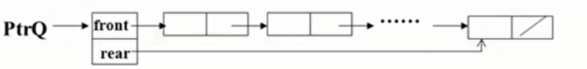

# 队列

队列Queue：具有一定操作约束的线性表

一端插入，另一端删除

数据插入AddQ入队

数据删除DeleteQ出队

FIFO

```c
类型名称：队列Queue

数据对象集：一个有0个或多个元素的有穷线性表

操作集：长度为MaxSize的队列Q属于Queue，队列元素item属于ElementType

1.Queue CreateQueue(int Maxsize)：创建一个长度为MaxSize的空队列
2.int IsFullQ(Queue Q, int MaxSize)：判定队列Q是否已满
3.void AddQ(Queue Q, ElementType item)：将数据元素item插入队列Q中
4.int IsEmpty(Queue Q)：判断队列Q是否为空
5.ElementType DeleteQ(Queue Q)：将队头数据元素从队列中删除并返回


```


### 
队列的顺序存储实现

**一位数组** +记录队头元素位置的变量** front**  + 记录队尾元素位置的变量**rear** 

```c
#define MaxSize<储存数据元素的最大位置>
struct QNode
{
  ElementType Data[MaxSize];
  int front;
  int rear;
} ;
typedef QNode * Queue; 
```


顺环队列

空和满的条件都是 rear == front

空满无法区分

解决方案：（1）额外标记Size/Tag（2）仅使用n-1个数组空间

**入队列 AddQ** 

```c
void AddQ(Queue PtrQ, ElementType item)
{
  if((PtrQ->rear)+1 % MaxSize == PtrQ->front)
  {
    printf("The Queue is Full.");
  }
  PtrQ->rear = (PtrQ->rear+1) % MaxSize;
  PtrQ->Data[Ptr->rear] = item;
} 
```


**出队列 DeleteQ** 

```c
ElementType DeleteQ(Queue PtrQ)
{
  if(PtrQ->rear == PtrQ->front){
    printf("The Queue is Empty.");
    return NULL;
  }
  else{
    PtrQ->front = (PtrQ->rear+1) % MaxSize;
    return PtrQ->Data[PtrQ->front];
  }
} 
```


### 
队列的链式存储实现

front是头还是尾？链表tail不知道前一个在哪里，不能做删除

head-front，tail-rear

```c
struct Node
{
  ElementType Data[MaxSize];
  struct Node * Next;
};

struct QNode
{
  struct QNode * front;
  struct QNode * rear;
};

typedef struct QNode * Queue; 
Queue PtrQ; 
```




**出队DeleteQ** 

```c
ElementType DeleteQ(Queue Q)
{
  struct Node * FrontCell;
  ElementType FrontElem;
  
  if(PtrQ->front == NULL)
  {
    printf("The Queue is Empty.");
    return NULL;
  }
  FrontCell = PtrQ->front;
  if(PtrQ->rear == PtrQ->front) // 如果队列里只有一个元素，删除后队列
  {
    PtrQ->front = PtrQ->rear = NULL;
  }else
  {
    PtrQ->front = PtrQ->front->Next;
  }
  FrontElem = FrontCell->Data;
  free(FrontCell);
  return FrontElem;
} 
```


