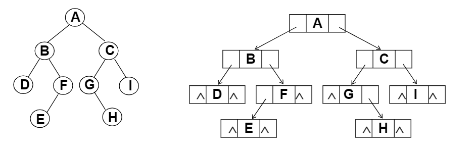

# 二叉树

二叉树T：一个有穷的结点集合，可以为空，如果不为空，那么他是由根结点和称为其左子树TL和右子树TR的两个不相交的二叉树组成的

二叉树有子树左右的顺序之分


特殊的二叉树：

斜二叉树 Skewed Binary Tree

完美二叉树/满二叉树 Perfect Binary Tree/Full Binary Tree

**完全二叉树Complete Binary Tree** ：有n个结点的二叉树，对树中的结点按照从上至下，从左到右的顺序编号，编号为i的结点和满二叉树中编号为i的结点在二叉树中的位置相同


二叉树的重要性质

1. 二叉树在第i层的最大结点数为$2^{i-1}$

2. 深度为k的二叉树具有的最大结点总数为$2^k-1,k \geq 1$，其实就是$\sum _{i=0} ^{k-1} 2^i$等比数列

3. 对任何非空二叉树T，若n0表示叶节点的个数，n2是度为2的非叶结点的个数，那么两者满足关系n0 = n2 + 1

利用边数证明：总结点数n0+n1+n2-1=边数 0*n0 + 1*n1 + 2*n2


### 二叉树的抽象数据类型定义

```c
类型名称：二叉树

数据对象集：一个有穷的结点集合，若不为空，则由根节点和其左右二叉子数组成

操作集：BT∈BinTree，Item∈ElementType，重要操作有：
1.Bool IsEmpty(BinTree BT)：判别BT是否为空
2.void Traversal(BinTree BT):遍历，按某顺序疯问每个结点
3.BinTree CreateBinTree():创建一个二叉树

常见的遍历方法
void PreOrderTraveral(BinTree BT):先序遍历-根->左->右
void InOrderTraveral(BinTree BT):中序遍历-左->根->右
void PostOrderTraveral(BinTree BT):后续遍历-左->右->根
void LevelOrderTraveral(BinTree BT):层次遍历-从上到下，从左到右
```


### 二叉树的存储结构

**1.顺序存储结构** 

完全二叉树：从上到下从左到右顺序

结点的父子关系：

1. 非根节点（序号i>1）的父节点的序号是[i/2]

2. 结点（序号i）的左孩子结点的序号是2i（若2i≤n，则没有左孩子结点）

3. 结点（序号i）的右孩子结点的序号是2i+1（若2i+1≤n，则没有左孩子结点）


一般二叉树也可以采用这种结构，但是会造成空间上的浪费


**2.链表存储结构** 

```c
typedef struct TreeNode * BinTree;
typedef BinTree Position;
struct TreeNode
{
  ElementType Data;
  BinTree Left;
  BinTree Right;
};
```




### 二叉树的遍历

**（1）先序遍历** 

遍历过程：1.访问其根节点 2.先序遍历左子树 3.先序遍历右子树

**A**  ( **B** DFE ) ( **C** GHI )

```c
void PreOrderTraveral(BinTree BT)
{
  if(BT)
  {
    printf("%d", BT->Data);
    PreOrderTraveral(BT->Left);
    PreOrderTraveral(BT->Right);
  }
} 
```


**（2）中序遍历** 

遍历过程：1.中序遍历其左子树 2.访问其根节点 3.中序遍历其右子树

( D**B** EF) **A**  ( GH**C** I )

```c
void InOrderTraveral(BinTree BT)
{
  if(BT)
  {
    InOrderTraveral(BT->Left);
    printf("%d", BT->Data);
    InOrderTraveral(BT->Right);
  }
} 
```


**（3）后序遍历** 

遍历过程：1.后序遍历其左子树2.后序遍历其右子树 3.访问其根节点 

( DEF**B**  ) ( HGI**C ** ) **A** 

```c
void PostOrderTraveral(BinTree BT)
{
  if(BT)
  {
    PostOrderTraveral(BT->Left);
    PostOrderTraveral(BT->Right);
    printf("%d", BT->Data);
  }
} 
```


总结：先序，中序，后续遍历过程，经过的节点路线一样，只是访问各个结点的时机不同


先序：第一次遇到；中序：第二次遇到；后序：第三次遇到


**二叉树的非递归遍历** 

思路：**使用堆栈** 

**以中序遍历为例** 

遇到一个结点，就把它压栈，并去遍历它的左子树

当左子树遍历结束后，从栈顶弹出这个结点并访问它

然后按其右指针再去中序遍历该节点的右子树

```c
void InOrderTraversal(BinTree BT)
{
  BinTree T = BT;
  Stack S = CreateStack(MaxSize); // 初始化一个堆栈S
  while(T || !IsEmpty(S))
  {
    while(T) // 如果左端有结点，沿左端将沿途的结点压到栈里
    {
      push(T);
      T = T-> Left;
    }
    if(!IsEmpty(S)) //左端没节点的时候，把栈里的元素弹出，转向右子树
    {
      T = Pop(S); 
      printf("%d", T->Data);
      T = T->Right;
    }
  }
} 
```


**层序遍历** 

二叉树遍历的核心：二维结构的线性化

从结点访问其左右儿子结点

访问完左儿子结点，需要一个存储结构保存暂时不访问的结点（堆栈or队列）


**队列实现：** 遍历从根节点开始，首先将根节点入队，然后开始执行循环，结点入队，访问该节点，左右儿子出队


```c
void LevelOrderTraversal(BinTree BT)
{
  Queue Q;
  BinTree BT;
  
  if(!BT) // 空树，直接返回
    return;
  Q = CreateQueue(MaxSize); // 初始化队列Q
  AddQ(Q, BT); // 根节点入队
  while(!IsEmptyQ(Q))
  {
    T = DeleteQ(Q); //访问结点
    printf("%d", T->Data);
    if(T->Left)
      AddQ(Q, T->Left);
    if(T->Right)
      AddQ(Q, T->Right);
  }
} 
```


**遍历二叉树的应用：** 

**1.输出二叉树的叶子节点** （检测结点的左右子树是否都为空）

```c
void PreOrderTraveral(BinTree BT)
{
  if(BT)
  {
    if(!BT->Left && !BT->Right)
      printf("%d", BT->Data);
    PreOrderTraveral(BT->Left);
    PreOrderTraveral(BT->Right);
  }
} 
```


**2.求二叉树的高度** （$Height=max\{H_L,H_R\}+1$）

```c
int PostOrderGetHeight(BinTree BT)
{
  int HL, HR, MaxH;
  if(BT)
  {
  HL = PostOrderGetHeight(BT->Left);
  HR = PostOrderGetHeight(BT->Right);
  MaxH = (HL > HR) ? HL : HR;
  return (MaxH + 1);
  }
  else return 0;
} 
```


**3.二元运算表达式树及其遍历** 


三种遍历可以得到三种不同的表达式

先序-前缀 ++a*bc*+*defg

中序-中缀 a+b*c+d*e+f*g（受到运算符优先级的影响）

后序-后缀 abc*+de*f+g*+


**4.两种遍历数列确定一个二叉树** ：中序+先序 或者 中序+后序

以**先序+中序** 为例

1. 根据先序遍历序列第一个结点确定根节点

2. 根据根节点在中序遍历序列中分割出左右两个子序列

3. 对左子树和右子树分别递归使用相同的方法进行分解

