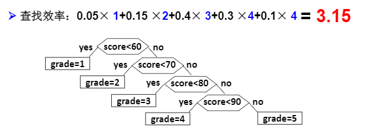
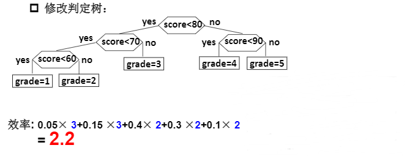
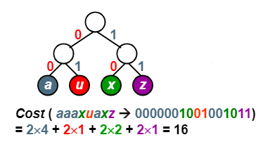
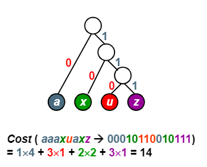
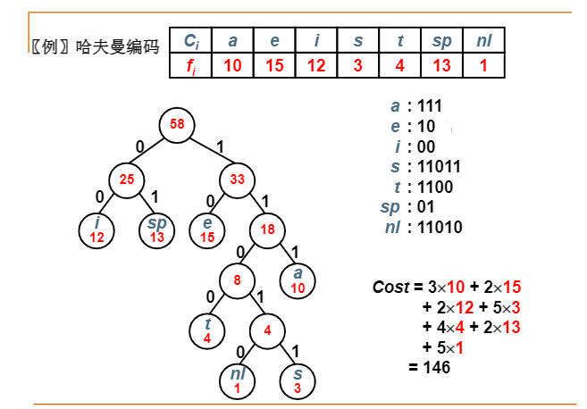

# 哈夫曼树与哈夫曼编码

### 
什么是哈夫曼树Huffman Tree

将百分制的考试成绩转换成五分制的成绩 e.g.

```c
if(score < 60) grade = 1;
else if(score <70) grade = 2;
else if(score <80) grade = 3;
else if(score <90) grade = 4;
else grade = 5 
```


判定树：



另一种方式判别：

```c
if(score < 80)
{
  if(score < 70)
  {
    if(score < 60) grade = 1;
    else grade = 2;
  }else if(score < 90) grade = 4;
}else grade = 5; 
```


判别树



效率不同！


**带权路径长度（WPL）** ：假设二叉树有n个叶子结点，每个叶子结点带有权值 $w_k$,从根结点到每个叶子结点的长度为 $l_k$，则每个叶子结点的带权路径长度之和就是：

$$
WPL = \sum_{k=1}^n w_k l_k
$$


**哈夫曼树（最优二叉树）** ：WPL最小的二叉树

### 
哈夫曼树的构造

每次把权值最小的两棵二叉树合并

如何选择最小的？利用**堆** ！排序方法效率不如堆

```c
typedef struct TreeNode * HuffmanTree;
struct TreeNode
{
  int Weight;
  HuffmanTree Left, Right;
};

HuffmanTree(MinHeap H)
{
  //
  int i; HuffmanTree T;
  BuildMinHeap(H); //
  for(i = 1; i < H->Size; i++)
  {
    T = (HuffmanTree)malloc(sizeof(TreeNode));
    T->Left = DeleteMin(H);
    T->Right = DeleteMin(H);
    T->Weight = T->Left->Weight + T->Right->Weight;
    Insert(H, T);
  }
  T = DeleteMin(H);
  return T;
}

```


复杂符$O(NlogN)$


哈夫曼树的特点

1. 没有度为1的结点；

2. n个叶子结点的哈夫曼树共有2n-1个结点（可以推导）

3. 哈夫曼树的任意非叶结点的左右子树交换之后仍然是**哈夫曼树** 

4. 堆同一组权值，存在不同构造的两棵哈夫曼树，WPL值是一样的


树的同构问题


# 哈夫曼编码

给定一段字符串，如何对字符进行面吗，使得该字符串的编码储存空间最少？

1. 等长ASCII编码

2. 等长3位编码

3. 不等长编码：出现频率高的字符编码短，频率低的编码长

如何进行不等长的编码？

如何避免二义性？

**前缀码prefix code** ：任何字符的编码都是不另一字符编码的前缀

利用前缀码可以无二义地解码


利用二叉树进行编码

（1）左右分枝：0，1

（2）字符只在叶结点上





编码长度最短：构造一个哈夫曼树




