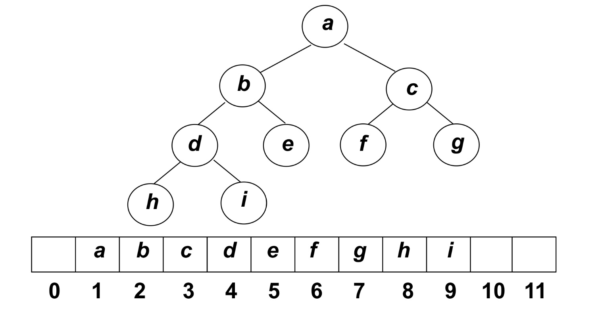
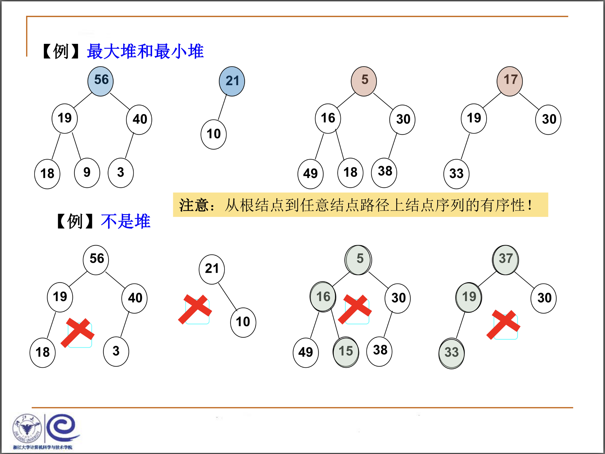

# 堆

### 
什么是堆heap

**优先队列Priority Queue** ：特殊的**队列** ，取出元素的顺序是按照元素的**优先权（关键字）** 大小，而不是元素进入队列的先后顺序


用数组或者链表实现有限队列：数组、链表、有序数组、有序链表都不能完美满足


是否可以用二叉树存储结构？

二叉搜索树BST？

如果采用二叉树，应该重点关注插入还是删除最大值，因为删除最大值更难做

完全二叉树！




堆的两个特性：

结构性：用数组表示的完全二叉树

有序性：任一结点的关键字是其子树所有结点的最大值或者最小值

&ensp;&ensp;&ensp;&ensp;1. 最大堆Maxheap也称为"大顶堆"：最大值

&ensp;&ensp;&ensp;&ensp;2. 最小堆Minheap 也称为"小顶堆"：最小值




从根结点到任意结点路径上的结点序列是有序的


### 
堆的抽象数据类型描述

以最大堆为例

```c
类型名称：最大堆（Maxheap）

数据对象集：完全二叉树，每个结点的元素值不小于其子结点的元素值

操作集：最大堆H属于MaxHeap，元素item属于ElementType，主要操作有：

1.MaxHeap Create(int MaxSize):创建一个空的最大堆
2.Bool IsFull(MaxHeap H):判断最大堆H是否已满
3.void Insert(MaxHeap H, ElementType item):将元素item插入最大堆
4.Bool IsEmpty(MaxHeap H):判断最大堆H是否为空
5.ElementType DeleteMax(MaxHeap H):返回H中的最大元素（高优先级）
```


最大堆的创建（用顺序存储结构）

```c
typedef struct HeapStruct * MaxHeap;
struct HeapStruct
{
  ElementType Data[Maxsize]; //存储堆元素的数组
  int Size; //当前元素的个数
  int Capacity; //堆的最大容量
};

MaxHeap Create(int MaxSize)
{
  //创建一个容量为MaxSize的空的最大堆
  MaxHeap H = (MaxHeap)malloc(sizeof(HeapStruct));
  H->Data = (ElementType)malloc(sizeof(ELementType));  
  H->Size = 0;
  H->Capacity = MaxSize;
  H->Data[0] = MaxData; //定义一个哨兵，大于堆中所有可能的元素的值，便于以后的操作
  return H;
} 
```


堆的插入：将新增结点插入到其父结点到根结点的有序序列中

```c
void Insert(MaxHeap H, ElementType item)
{
  // 将元素item插入到最大堆H，其中H->Element[0]已经定义为哨兵
  int i；
  if(IsFull(H))
  {
    printf("The MaxHeap is Empty.")；
  }
  i = ++H->Size;// i指向插入后堆的最后一个元素
  for( ; H->Element[i/2] < item; i/=2)
  {
    //向下过滤结点，如果新的元素比他的父亲结点大，把他和父亲结点交换
    H->Element[i] = H->Element[i/2]; 
   
  }
  H->Element[i] = item; //将item插入
} 
```


H→Element[0]是设置的哨兵元素，它不小于堆中的最大元素，控制循环结束

复杂度 $T(N)=O(logN)$


堆的删除：取出根结点的元素（也就是最大的元素），同时删除堆的一个结点

```c
ELementType DeleteMax(MaxHeap H)
{
  //从最大堆H中取出键值为最大的元素，并删除一个结点
  int Parent, Child;
  ElementType MaxItem, temp;
  if(IsEmpty(H))
    printf("The MaxHeap is Empty.");
  MaxItem = H->Element[1]; // 取出根结点的最大值
  temp = H->Element[H->Size--]; //用最大堆的最后一个元素开始向上过滤下层结点
  for(Parent = 1; Parent * 2 <= H->Size; Parent = Child)
  {  
    Child = Parent * 2;
    if((Child != H->Size) && (H->Element[Child] < H->Element[Child+1]))
      Child++; //Child指向孩子结点的最大值
    if(temp >= H->Element[Child]) //如果找到了最大值
      break;
    else
      H->Element[Parent] = H->ELement[Child]; //移动temp元素到下一层
  }
  H->Element[Parent] = temp;
  return MaxItem;
} 

```


堆的建立

将已经存在的N个元素按照最大堆的要求存放在一个一位数组之中

方法1:N次插入 复杂度 $O(NlogN)$

方法2:线性时间复杂度

&ensp;&ensp;&ensp;&ensp;1.将N个元素按照输入顺序存入，满足完全二叉树的结构特性

&ensp;&ensp;&ensp;&ensp;2.调整各个结点位置，以满足最大堆的有序特性

&ensp;&ensp;&ensp;&ensp;

```c
void PercDown(MaxHeap H, int p)
{
  //下滤：将H中以H->Data[p]为根的子堆调整为最大堆
  int Parent, Child;
  ElementType X;
  
  X = H->Data[p];
  for(Parent = p; Parent*2 <= H->Size; Parent = Child)
  {
    Child = Parent * 2;
    if((Child != H->Size) && (H->Data[Child] < H->Data[Child+1]))
      Child++;
    if(X >= H->Data[Child])
      break;
    else
      H->Data[Parent] = H->Data[Child];
  }
  H->Data[Parent] = X;  
}

void BuildHeap(MaxHeap H)
{
  \\调整H->Data[]中的元素，使满足最大堆的有序性
  \\假设所有的H->Size个元素都已经存在H->Data[]中
  int i;
  
  for(i = H->Size/2; i > 0; i--)
    PercDown(H, i);
} 
```


