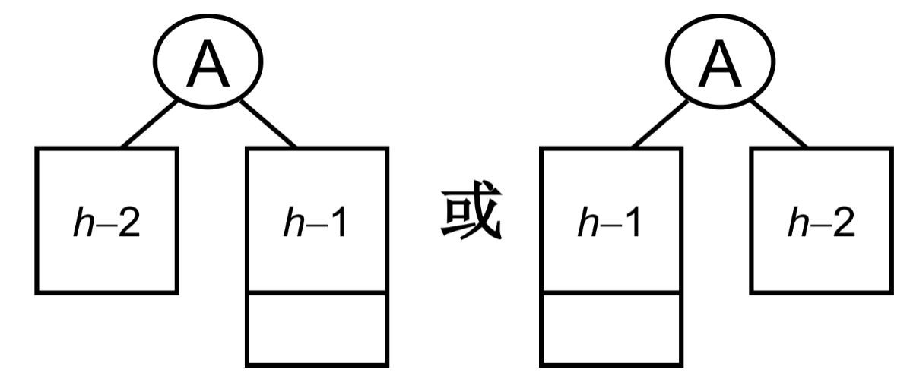
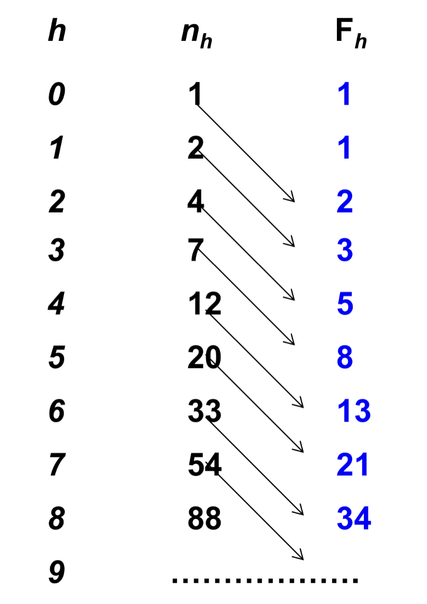

# 平衡二叉树

### 
什么是平衡二叉树


二叉搜索树树结点不同的插入次序，导致不同的深度和**平均查找长度ASL** 不同


**平衡二叉树是一种特殊的二叉搜索树** 


**平衡因子** Balance Factor（**BF** ）$B F(T)=h_L - h_R$

其中 $h_L$ $h_R$分别为T的左右子树的高度


**平衡二叉树Balanced Binary Tree** （**AVL树** <-提出平衡二叉树的科学家的名字）

空树，或者任意结点左右子树高度差绝对值不超过1，即$|{BF(T)≤1}|$


**平衡二叉树的高度能够达到 ** $log_2 n$**吗？** 

证明：夹着 $n_h$为高度为h的平衡二叉树的最少结点数，结点数最少时

$$
n_h = n_{h-1}+n_{h-2}+1
$$




类似斐波那契数列的递推关系式

$$
n_h = n_{h-1} + n_{h-2}+1\\n_h=F_{h+2}-1\\F_i = \frac{1}{\sqrt{5}}(\frac{1+\sqrt{5}}{2})^i\\n_h = \frac{1}{\sqrt 5}(\frac{1+\sqrt 5}{2})^{h+2}-1\\h=O(log_2 n)
$$





### 
平衡二叉树的调整

保证调整后一定是搜索树

1.RR旋转

插入的元素在发现者的右子树的右边，所以叫RR插入，需要进行RR旋转（右单旋）


2.LL旋转

插入的元素在发现者的左子树的左边，所以叫LL插入，需要进行LL旋转（左单旋）


3.LR旋转

插入的元素在发现者的左子树的右边，所以叫LR插入，需要进行LR旋转


创建

```c
typedef struct AVLNode * Position;
typedef Position AVLTree; //AVL树类型
struct AVLNode
{
  ElementType Data; //结点数据
  AVLTree Left; //指向左子树
  AVLTree Right; //指向右子树
  int Heigth; //树高
};
```


旋转

```c
AVLTree SingleLeftRotation(AVLTree A)
{
  //AVL树A必须有一个左子结点B
  //步骤：将A与B左单旋，更新A和B的高度，返回新的根结点B
  
  AVLTree B = A->Left;
  A->Left = B->Right;
  B->Right = A;
  A->Height = Max(GeiHeight(A->Left), GetHeight(A->Right));
  B->Height = Max(GeiHeight(B->Left), GetHeight(B->Right));

  return B;
}

AVLTree SingleRightRotation(AVLTree A)
{
  //AVL树A必须有一个右子结点B
  //步骤：将A与B右单旋，更新A和B的高度，返回新的根结点B
  
  AVLTree B = A->Right;
  A->Right = B->Left;
  B->Left = A;
  A->Height = Max(GeiHeight(A->Left), GetHeight(A->Right));
  B->Height = Max(GeiHeight(B->Left), GetHeight(B->Right));

  return B;
}

AVLTree DoubleLeftRightRotation(ASLTree A)
{
  //A必须有一个左子结点B，B必须有一个右子结点C
  //A、B与C做两次单选，返回新的根结点C
  
  // B、C做右单旋，返回C
  A->Left = SingleRightRotation(A->Left);
  // A、C做左单旋，返回C
  return SingleLeftRotation(A);
} 

AVLTree DoubleRightLeftRotation(ASLTree A)
{
  //A必须有一个右子结点B，B必须有一个左子结点C
  //A、B与C做两次单选，返回新的根结点C
  
  // B、C做左单旋，返回C
  A->Right = SingleLeftRotation(A->Right);
  // A、C做右单旋，返回C
  return SingleRightRotation(A);
}  
```


插入

```c
AVLTree Insert(AVLTree T, ElementType X)
{
  // 将X插入到AVL树中，并返回调整后的AVL树
  if(!T) // 如果是空树，创建一个新的树
  {
  T = (AVLTree)malloc(sizeof(struct AVLNode));
  T->Data = X;
  T->Left = T->Right = NULL;
  T->Height = 0;
  }
  else if(X < T->Data) //插入左子树，递归
  {
    T->Left = Insert(T->Left, X);
    if(GetHeight(T->Left)-GetHeight(T->Right) == 2) //判断是否需要左旋
      if(X < T->Left->Data)
        T = SingleLeftRotation(T);
      else
        T = DoubleLeftRightRotation(T);
  }
  
  else if(X > T->Data) //插入右子树，递归
  {
    T->Right = Insert(T->Right, X);
    if(GetHeight(T->Left)-GetHeight(T->Right) == 2)//判断是否需要右旋
      if(X<T->Left->Data)
        T = DoubleRightLeftRotation(T);
      else
        T = SingleRightRotation(T);
  }
  //不要忘记更新树高
  T->Height = Max(GetHeight(T->Left), GetHeight(T->Right));
  
  return T;
} 
```


