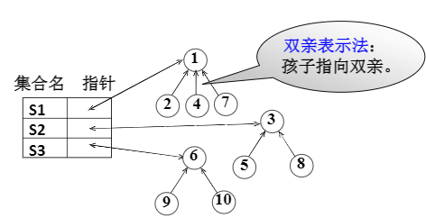
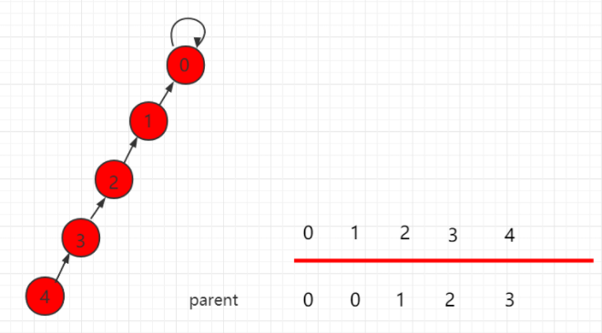
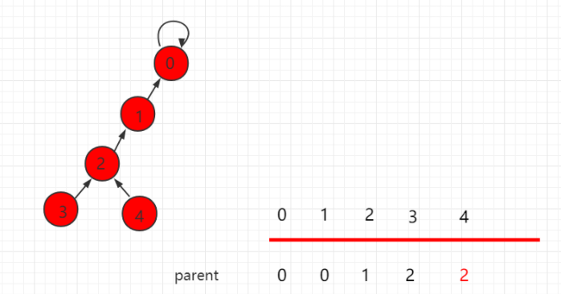
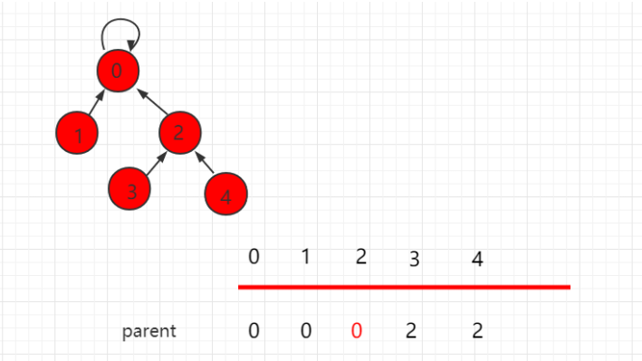
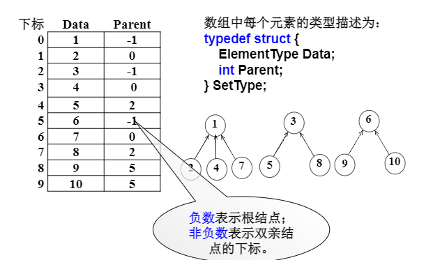

# 并查集

### 
集合的表示

集合运算：交并补差，判定一个元素是否属于某一集合

**并查集** ：集合并、查某元素属于什么集合


电脑连线问题

传递性

1. 10台电脑看成10个集合

2. 连接状态等于将集合合并

3. 查询x和y是否连通就是判别x和y是否属于同一个集合


可以用树表示一个集合，每一个结点代表一个集合元素（已知孩子要指向父亲，**双亲表示法** ），直接用数组可以存储（**结构数组** ）



但是要进行**路径压缩** 








```c
typedef struct
{
  ElementType Data;
  int Parent;
} SetType;
```





查找某个元素所在的集合（用根节点表示）

```c
int Find(SetType S[], ElementType X)
{
  //在数组S中查找值位X的元素所属于的集合
  int i;
  for(i = 0; i < MaxSize && S[i].Data != X; i++);
  if( i >= MaxSize)
    return -1;
  for(; S[i].Parent >= 0; i = S[i].Parent);
  return i;
} 
```


并运算

分别找到X1和X2两个元素所在的集合树的根节点

如果他们不同根，九八其中一个根节点的父节点指针设置为另一个根节点的数组的下标

把小的集合并到大的集合里面去

```c
void Union(SetType S[], ElementType X1, ElementType X2)
{
  int Root1, Root2;
  Root1 = Find(S, X1);
  Root2 = Find(S, X2);
  if(Root1 != Root2)
    S[Root2].Parent = Root1;
} 
```


### 简化表示

