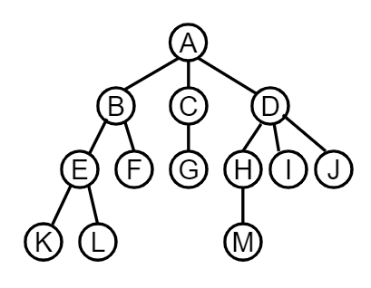
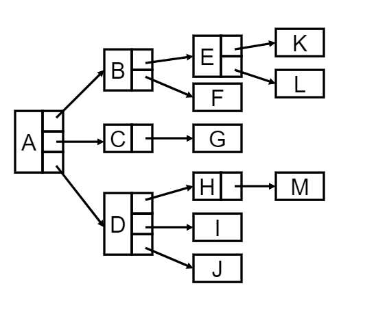
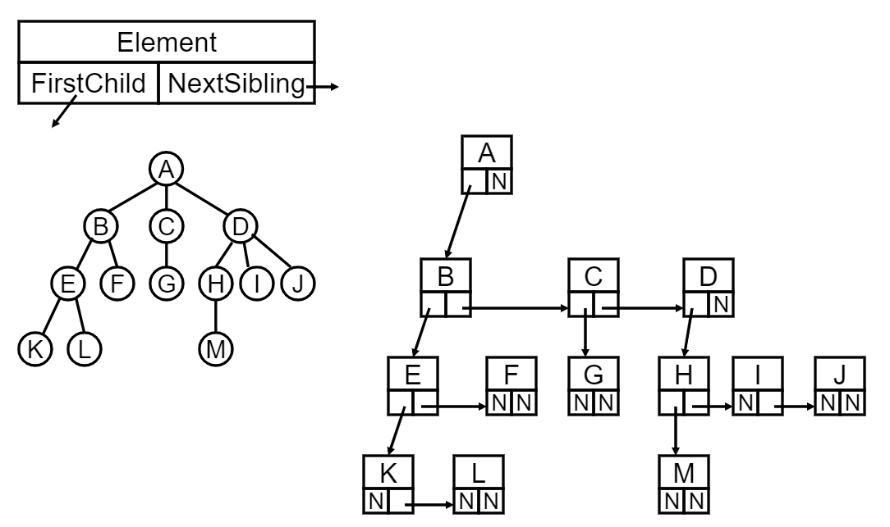

# 树和树的表示

### 


### 
什么是树

一种层次关系

高效查找


### 
查找Searching

根据某个关键字K，在集合R中找到关键字与K相同的记录

· 静态查找：集合中的记录是固定的，只有查找（查字典）

· 动态查找：集合中的记录是动态变化的，除了查找还可能发生插入和删除

### 
静态查找

**方法1 顺序查找** 

```c
int SequentialSearch(StaticTable *Tbl, ElementType K)
{
  /* 在表Tbl[1]~Tbl[n]中查找关键字为K的数据元素*/
  int i;
  Tbl->Element[0] = K; // 建立一个哨兵，可以倒序查找
  for(i = Tbl->Length; Tbl->Element[i] != K; i--);
  return i; //成功返回下标i，不成功也可以返回哨兵0
}

```


哨兵的作用：少写一个判定的条件

复杂度 $O(N)$


**方法2 二分查找 Binary Search** 

假设n个数据元素的关键字**有序存放** ，并且是**连续存放** （数组），则可以进行二分查找

left mid right

二分查找实现：

```c
int BinarySearch(StaticTable * Tbl, ElementType K)
{
  int left, mid, right, NotFound = 1;
  left = 1;
  right = Tbl->Length;
  while(left <= rigth)
  {
    mid = (left + right)/2;
    if(K < Tbl->Element[mid])
      rigth = mid-1;
    else if(K > Tbl->Element[mid])
      left = mid+1;
    else
      return mid;
  }
  return NotFound;
} 
```


复杂度 $O(logN)$


**二分查找判定树** 

判定树上每个结点需要的查找次数刚好为该结点所在的层数（第一层开始）

查找成功时的查找次数不会超过判定树的深度

n个节点的判定树深度为 $[log_2 n] + 1$


树方便插入和删除，可以实现动态查找


**树的定义** 

n（n≥0）个结点构成的有限集合

n=0时，称为**空树** 

对于任一棵非空树，具备一下性质

1. 树中有一个称为"**根Root** "的特殊结点，用 $r$表示

2. 其余结点可分为m个互不相交的有限集合T1，T2，...，Tm，其中每个集合本身又是一棵树，称为原来树的"子树SubTree"

3. 子树是不相交的

4. 除了根结点外，每个结点有且仅有一个父结点

5. 一棵N个结点的树有N-1条边

一些术语：

1. **结点的度Degree** ：结点的子树的个数

2. **树的度** ：树所有结点中最大的度

3. **叶结点Leaf** ：度为0的树

4. **父结点Parent** ：有子树的结点是其子树根结点的父结点

5. **子结点Child** ：和父结点相反，或称孩子结点

6. **兄弟结点Sibling** ：具有同一个父结点的各结点彼此是兄弟结点

7. **路径和路径长度** ：从结点n1到nk的路径为一个结点序列n1，n2，...，nk，ni是ni+1的父结点，路径包含的边数是路径的长度

8. **祖先结点Ancestor** ：沿树根到某一结点路径上的所有结点都是这个结点的祖先结点

9. **子孙结点Descendant** ：某一结点的子树中的所有结点是这个结点的子孙结点

10. **结点的层次Level** ：规定根结点在1层，其他任一结点的层数是其父结点的层数加1

11. **树的深度Depth** ：树中所有结点中的最大层次是这个树的层数


### 
树的表示

数组困难，子树个数不一样



链表困难，结构形式不一样



所有结点结构相同，没有子树就指向NULL，指针域空间上的浪费


**儿子兄弟表示法** 

旋转45度 就变成二叉树




