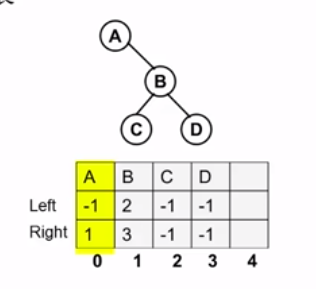

# 树的同构

给定两棵树T1和T2，如果T1可以通过若干次左右儿子互换变成T2，则我们称两棵树是同构的


1. 二叉树的表示

2. 建二叉树

3. 同构判别


### 二叉树表示

结构数组表示二叉树：静态链表（思想是链表，存储是数组）



```c
#define MaxTree 10
#define ElementType char
#define Tree int
#define Null -1 // NULL和Null不同 

struct TreeNode
{
  ElementType ELement;
  Tree Left;
  Tree Right;
}T1[MaxTree], T2[MaxTree];
```


根节点：谁没指向它


### 程序的框架

