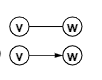

# 什么是图？

六度空间理论

最短路径

最小生成树


什么是图？**多对多** 的关系（包含线性表和数）

包含：

一组顶点：通常用 $V$（Vertex）表示顶点集合

一组边：通常用 $E$（Edge）表示边的集合

&ensp;&ensp;&ensp;&ensp;边是顶点对： $(v，w)$$\in$E，其中  $v,\ w\in V$

&ensp;&ensp;&ensp;&ensp;有向边： $<v, w>$表示从 $v$指向 $W$的边（单行线）

&ensp;&ensp;&ensp;&ensp;不考虑重边（无向边只有一条）和自回路（有向边不会指向自己）




抽象数据类型定义

```c
类型名称：图（Graph）

数据对象集：G（V，E）是由一个非空的有限顶点集合V和一个有限边集合E组成

操作集：对于任意图G属于Graph，以及v属于V，e属于E

1.Graph Create():建立并返回空图；
2.Graph InsertVertex(Graph G, Vertex v):将v插入G
3.Graph InsertEdge(Graph G, Edge e):将e插入G
4.void DFS(Graph G, Vertex v):从顶点v出发深度优先搜索遍历图G
5.void BFS(Graph G, Vertex v):从顶点v出发广度优先搜索遍历图G
6.void ShortestPath(Graph G, Vertex v, int Dist[]):计算图G中顶点v到任意其他任意顶点的最短路径
7.void MST(Graph G) :计算图G的最小生成树
```


常见术语

**无向图** 

**有向图** 

**网络：带权重** 


### 
如何在程序中表示一个图？

**1.邻接矩阵 ** $G[N][N]$

N个顶点从0～N-1编号

$$
G[i][j]=\begin{cases}1 ,\ 若<v_i,v_j>是G中的边\\0,\ 否则\end{cases}
$$


1. 对角阵为0

2. 对称矩阵

问题：对无向图的存储，怎样可以省一半的空间

只存一半的元素！

用一个长度为 $\frac{N(N+1)}{2}$的一维数组A存储 $\{G_{00},G_{10},G_{11},...,G_{n-1\ 0},...,G_{n-1\ n-1}\}$则 $G_{ij}$在A中对应的下标为： $\frac{i(i+1)}{2}+j$


对于网络，只需要把 $G[i][j]$的值定义为边 $<v_i, v_j>$的权重即可

$v_i, v_j$在网络中如果没有边该怎么办？（后面解决）


好处：

1. 简单直观好理解

2. 容易检查任意顶点之间有没有边

3. 方便找任意顶点的"领接点"，无向图扫描行或列非零，有向图扫描行和列非零项

4. 方便计算任意顶点的度（从该点出发的边数"出度"，指向给点的边数"入度"）

&ensp;&ensp;&ensp;&ensp;1. 无向图：对应行或列非零元素的个数

&ensp;&ensp;&ensp;&ensp;2. 有向图：对应行的非零元素个数"出度"，对应列非零元素个数"入度"

&ensp;&ensp;&ensp;&ensp;

坏处：

1. 浪费空间-存稀疏图（点很多，边很少）有大量无效元素

&ensp;&ensp;&ensp;&ensp;对稠密图（特别是完全图（边数极大））还是很合算的

2. 浪费时间-统计稀疏图中一共有多少条边


**2.邻接表G** [N]

指针数组，对应矩阵每行一个链表，只存非0元素


一条边被存了两遍，一条边占了两个整数空间

对于网络，还要增加权重的域


邻接表，一定要够稀疏才合算


好处

1. 方便找任一顶点的所有"领接点"

2. 节约稀疏图的空间

&ensp;&ensp;&ensp;&ensp;需要N个头指针+ 2E个结点（每个结点至少2个域）

3. 方便计算任一顶点的度？

&ensp;&ensp;&ensp;&ensp;对无向图 Yes

&ensp;&ensp;&ensp;&ensp;对有向图 只能计算出度，需要构造逆邻接表（指向自己的边）才能计算入度

4. 方便检查任意一对顶点间是否存在边？ No


### 
如何建立图

### 
用邻接矩阵表示图

建立

```c
#define MaxVertexNum 100    /* 最大顶点数设为100 */
#define INFINITY 65535        /* ∞设为双字节无符号整数的最大值65535*/
typedef int Vertex;         /* 用顶点下标表示顶点,为整型 */
typedef int WeightType;        /* 边的权值设为整型 */
typedef char DataType;        /* 顶点存储的数据类型设为字符型 */


//定义图：顶点数，边数，二维数组记录权重，一维数组存储数据
typedef struct GNode * PtrToGNode;
struct GNode
{
  int Nv;
  int Ne;
  WeightType G[MaxVertexNum][MaxVertexNum]
  DataType Data[];
};
typedef PtrToGNode MGraph; 
```


初始化顶点

```c
MGraph CreateGraph(int VertexNum)
{
  //初始化一个具有VertexNum个顶点但是没有边的图
  Vertex V,W;
  MGraph Graph;
  
  Graph = (MGraph)malloc(sizeof(struct GNode));
  Graph->Nv = VertexNum;
  Graph->Ne = 0;
  for(V = 0; V<G->Nv; V++)
    for(W = 0; W<G->Nv; W++)
      Graph->G[V][W] = INFINITY;
      
  return Graph;
}
 
```


插入边

```c
// 定义边：两个顶点V1、V2，边的权重值
typedef ENode * Edge;
struct ENode
{
  Vertex V1, V2;
  WeightType Weight;
};

void InsertEdge(MGraph Graph, Edge E)
{
  Graph->G[E->V1][E->V2] = E->Weight;
  Graph->G[E->V2][E->V1] = E->Weight;
} 
```


完整的建立一个MGraph

```c
MGraph BuildGraph()
{
    MGraph Graph;
    Edge E;
    Vertex V;
    int Nv, i;
    
    scanf("%d", &Nv);   /* 读入顶点个数 */
    Graph = CreateGraph(Nv); /* 初始化有Nv个顶点但没有边的图 */ 
    
    scanf("%d", &(Graph->Ne));   /* 读入边数 */
    if ( Graph->Ne != 0 ) { /* 如果有边 */ 
        E = (Edge)malloc(sizeof(struct ENode)); /* 建立边结点 */ 
        /* 读入边，格式为"起点 终点 权重"，插入邻接矩阵 */
        for (i=0; i<Graph->Ne; i++) {
            scanf("%d %d %d", &E->V1, &E->V2, &E->Weight); 
            /* 注意：如果权重不是整型，Weight的读入格式要改 */
            InsertEdge( Graph, E );
        }
    } 

    /* 如果顶点有数据的话，读入数据 */
    for (V=0; V<Graph->Nv; V++) 
        scanf(" %c", &(Graph->Data[V]));

    return Graph;
} 
```


快速的方法：

```c
int G[MAXN][MAXN], Nv, Ne;
void BuildGraph();
{
  int i, j, v1, v2, w;
  
  scanf("%d", &Nv);
  for(i = 0; i < Nv; i++)
    for(j = 0; j< Nv, j++)
      G[i][j] = 0;
  scanf("%%d", &Ne);
  for(i = 0; i < Ne, i++)
  {
    scanf("&d &d %d", &v1, &v2, &w);
    G[v1][v2] = w;
    G[v2][v1] = w;
  }
    
    
} 
```


### 
用邻接表表示图

大部分内容和前面一样

建立

```c
#define MaxVertexNum 100    /* 最大顶点数设为100 */
typedef int Vertex;         /* 用顶点下标表示顶点,为整型 */
typedef int WeightType;        /* 边的权值设为整型 */
typedef char DataType;        /* 顶点存储的数据类型设为字符型 */

// 定义边：顶点V1、V2，权重值
typedef ENode * Edge;
struct ENode
{
  Vertex V1, V2;
  WeightType Weight;
};

// 定义邻接点：邻接点AdjV，权重值，下一个结点
typedef struct AdjVNode * PtrToAdjVNode;
struct AdjVNode
{
  Vertex AdjV;
  WeightType Weight;
  PtrToAdjVNode Next;
};
 
// 定义表头结点：结构数组(头指针和数据)
typedef struct VNode * AdjList[MaxVertexNum]
struct VNode;
{
  PtrToAdjVNode FirstEdge; // 边表头指针 
  DataType Data;
};

// 定义图结点：顶点数，边数，邻接表G是个数组
typedef struct GNode *PtrToGNode;
struct GNode{  
    int Nv;     // 顶点数
    int Ne;     // 边数
    AdjList G;  // 邻接表
};
typedef PtrToGNode LGraph; // 以邻接表方式存储的图类型
```


初始化顶点但没有边的图

```c
LGraph CreateGraph(int VertexNum)
{
  Vertex V;
  LGraph Graph;
  
  Graph = (LGraph)malloc(sizeof(struct GNode));
  Graph->Nv = VertexNum;
  Graph->Ne = 0;
  
  
  /* 初始化邻接表头指针 */
  /* 注意：这里默认顶点编号从0开始，到(Graph->Nv - 1) */
  for(V = 0; V < VertexNum; V++)
    Graph->G[V].FirstEdge = NULL;
    
  return Graph;
} 
```


插入边

```c
void InsertEdge(LGraph Graph, Edge E)
{
  PtrToAdjVNode NewNode;
  
  /* 插入边 <V1, V2> */
  /* 为V2建立新的邻接点 */
  NewNode = (PtrToAdjVNode)malloc(sizeof(struct AdjVNode));
  NewNode->AdjV = E->V2;
  NewNode->Weight = E->Weight;
  NewNode->Next = Graph->G[E->V1].FirstEdge;
  Graph->G[E->V1].FirstEdge = NewNode;
  
  /* 若是无向图，还要插入边 <V2, V1> */
  /* 为V1建立新的邻接点 */
  NewNode = (PtrToAdjVNode)malloc(sizeof(struct AdjVNode));
  NewNode->AdjV = E->V1;
  NewNode->Weight = E->Weight;
  /* 将V1插入V2的表头 */
  NewNode->Next = Graph->G[E->V2].FirstEdge;
  Graph->G[E->V2].FirstEdge = NewNode;

} 
```


完整建立一个LGraph

```c
LGraph BuildGraph()
{
    LGraph Graph;
    Edge E;
    Vertex V;
    int Nv, i;
    
    scanf("%d", &Nv);   /* 读入顶点个数 */
    Graph = CreateGraph(Nv); /* 初始化有Nv个顶点但没有边的图 */ 
    
    scanf("%d", &(Graph->Ne));   /* 读入边数 */
    if ( Graph->Ne != 0 ) { /* 如果有边 */ 
        E = (Edge)malloc( sizeof(struct ENode) ); /* 建立边结点 */ 
        /* 读入边，格式为"起点 终点 权重"，插入邻接矩阵 */
        for (i=0; i<Graph->Ne; i++) {
            scanf("%d %d %d", &E->V1, &E->V2, &E->Weight); 
            /* 注意：如果权重不是整型，Weight的读入格式要改 */
            InsertEdge( Graph, E );
        }
    } 

    /* 如果顶点有数据的话，读入数据 */
    for (V=0; V<Graph->Nv; V++) 
        scanf(" %c", &(Graph->G[V].Data));

    return Graph;
}
```


