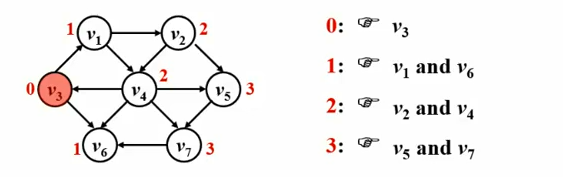

# 最短路径问题

### 
最短路径问题

在网络中，求两个不同顶点之间的所有路径中，边的权值之和最小的那一条路径

&ensp;&ensp;&ensp;&ensp;这条路径就是两点之间的**最短路径Shortest Path** 

&ensp;&ensp;&ensp;&ensp;第一个顶点叫**源点Source** 

&ensp;&ensp;&ensp;&ensp;最后一个顶点叫**重点Destination** 

&ensp;&ensp;&ensp;&ensp;

**单源** 最短路径问题：从某一固定的源点出发，求其到所有其他顶点的最短路径

&ensp;&ensp;&ensp;&ensp;（有向）无权图

&ensp;&ensp;&ensp;&ensp;（有向）有权图

**多源** 最短路径问题：求任意两顶点之间的最短路径


### 
无权图的单源最短路算法

按照递增（非递减）的顺序找出到各个顶点的最短路



BFS！

```c
void BFS(Vertex S)
{
  visited[S] = true;
  Enqueue(S, Q);
  while(!IsEmpty(Q))
  {
    V = Dequeue(Q);
    for(V的每个邻接点W)
    {
      if(visited[W])
      {
        visited[W] = true;
        Enqueue(W, Q)
      }
    }
  }
}
```


**Visited[]可以删掉** 

但是还是需要另外一个东西判断是否访问过

**dist[W] = S到W的最短距离** 


**dist[S] = 0** 

**其他点定义为-1** 

怎么跳

**path[W] = S** 到W的路上经过的某顶点

```c
void Unweighted(Vertex S)
{
  Enqueue(S, Q);
  while(!IsEmpty(Q))
  {
    V = Dequeue(Q);
    for(V的每个邻接点W)
      if(dist[W] == -1)
      {
        dist[W] = dist[V] + 1;
        path[W] = V;
        Enqueue(W, Q);
      }
  }
}
```


时间复杂度 $O(|V|+|E|)$


### 
有权图的单源最短路算法


负值圈negative-cost cycle

 

按照递增顺序找出带各个顶点的最短路


## Dijkstra算法

令 $S=\{源点s + 已经确定了最短路径的顶点v_i\}$

对任一未收录的顶点 $v$，定义 $dist[v]$为 $s$到 $v$的最短路径长度，但该路径仅经过 $S$中的顶点，即路径 $\{s→(v_i \in S)→v\}$的最小长度


假设路径是按照递增（非递减）的顺序生成的，则

&ensp;&ensp;&ensp;&ensp;真正的最短路必须只经过S中的顶点

&ensp;&ensp;&ensp;&ensp;每次从未收录的顶点中选一个dist最小的收录（贪心）

&ensp;&ensp;&ensp;&ensp;增加一个v进入s，可能会影响另一个w的dist值
&ensp;&ensp;&ensp;&ensp;
&ensp;&ensp;&ensp;&ensp;

```c
void Dijkstra(Vertex s)
{
  while(1)
  {
    V = 未收录顶点中dist最小者;
    if(这样的V不存在)
      break;
    collected[V] = true;
    for(V的每个邻接点W)
      if(collected[W] == false)
      {
        if(dist[V]+E_<V, W> < dist[W])
        {
          dist[W] = dist[V] + E_<V, W>;
          path[W] = V; 
         } 
      }
  }
}
```


不能有负边

时间复杂度 取决于更新最小路径的算法

方法1:直接扫描所有的未收录顶点- $O(|V|)$

 $T=O(|V|^2+|E|)$

方法2:将dist存在最小堆里- $O(log|V|)$

更新dist[w]的值- $O(log|V|)$

 $T=O(|V|log|V|+|E|log|V|)=O(|E|log|V|)$

对稀疏图效果好


### 
多源最短路算法

方法1:直接将单源最短路算法调用｜V｜遍

对稠密图来说， $T=O(|V|^3+|E| \times |V|)$

**对稀疏图效果好，E少复杂度低** 

方法2:对稠密图效果好

## Floyd算法

 $T=O(|V|^3)$

$D^k[i][j]=路径\{i→\{l≤k\}→j\}的最小长度$

只经过一部分顶点

一步步递推

 $D^0, D^1, ..., D^{|V|-1}[i][j]即给出了i到j的真正最短路径$

最初的 $D^{-1}$是什么？全是0，没有边相连初始化为正无穷


递推原理：

&ensp;&ensp;&ensp;&ensp;或者 $k\notin 最短路径\{i→\{l≤k\}→j\}, 则D^k=D^{k-1}$：不在最短路径里保持原样

&ensp;&ensp;&ensp;&ensp;或者 $k\in 最短路径\{i→\{l≤k\}→j\}$, 则该路径必定由两端最短路径组成: $D^k[i][j] = D^{k-1}[i][k]+D^{k-1}[k][j]$

&ensp;&ensp;&ensp;&ensp;

```C
void Floyd()
{
  for(i = 0; i , N; i++)
    for(j = 0; j < N; j++)
    {
      D[i][j] = G[i][j];
      path[i][j] = -1;
    }
  for(k = 0; k , N; i++)
    for(i = 0; i < N; j++)
      for(j = 0; j , N; i++)
      {
        if(D[i][k] + D[k][j] < D[i][j])
        {
          D[i][j] = D[i][k] + D[k][j];
          path[i][j] = k;
        }
      }
}
```


$T = O(|V|^3)$


