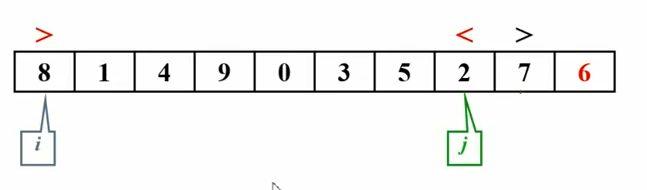
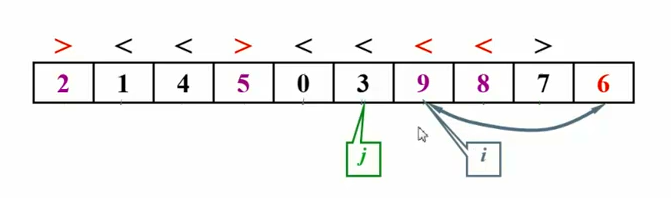

# 快速排序

思路：**分而治之** 

选主元pivot

伪码描述

```c
void Quicksort(ElementType A[], int N)
{
  if(N < 2) return;
  pivot = A[]中选取一个主元；
  将S = {A[] \ pivot}分成2个独立子集;
    A1={a属于S｜a <= pivot}和 A2={a属于S｜a >= pivot};
  A[] = Quicksort(A1, N1)+ A[] + Quicksort(A2, N2);
} 
```


最好情况： $T(N) = O(NlogN)$


### 选主元

令pivot = A[0]？啥b，太🎤慢了

随机取pivot？rand()函数不行

取头中尾的中位数

```c
ELementType Median3(ELementType A[], int Left, int Right)
{
  int Center = (Left + Right) / 2;
  if(A[Left] > A[Center])
    Swap(&A[Left], &A[Center]);
  if(A[Left] > A[Right])
    Swap(&A[Left], &A[Right]);
  if(A[Center] > A[Right])
    Swap(&A[Center], &A[Right]);
  // A[Left] <= A[Center] <= A[Right]
  Swap(&A[Center], &A[Right-1]) //将pivot藏到右边 
  // 接下来只需要考虑A[Left+1]到A[Right-2] 
  return A[Right-1];
}
```


### 
子集划分

快速排序之所以快，是因为主元一次性被放在了正确的位置





如果有元素正好等于pivot怎么办？

&ensp;&ensp;&ensp;&ensp;停下来交换？复杂度低

&ensp;&ensp;&ensp;&ensp;不理它，继续移动指针？复杂度太高，每次主元被放在末尾

&ensp;&ensp;&ensp;&ensp;

快速排序的问题：用递归...对小规模数据，可能还不如插入排序来的快

解决方案：当递归的数据规模充分小，则停止递归，直接调用简单排序

定义一个cutoff阈值，小于cutoff时，就不递归了


### 
算法实现

```c
void Quicksort(ELementType A[], int Left, int Right)
{  if(Cutoff <= Right-Left)
  {
    Pivot = Median3(A, Left, Right);
    i = Left;
    j = Right-1;
    for(; ; )
    {
      while(A[++i] < Pivot);
      while(A[--j] > Pivot);
      if(i < j)
      {
        Swap(&A[i], &A[j]);
      }else
      {
        break;
      }
    }
    Swap(&A[i], &A[Right-1]);
    Quicksort(A, Left, i-1);
    Quicksort(A, i+1, Right);
  }
  else
  {
    Insertion_Sort(A+Left, Right-Left+1)
  }
}

void Quick_Sort(ElementType A[], int N)
{
  Quicksort(A, 0, N-1)
} 
```


### 直接调用库函数

```c
/* 快速排序 - 直接调用库函数 */

#include <stdlib.h>

/*---------------简单整数排序--------------------*/
int compare(const void *a, const void *b)
{ /* 比较两整数。非降序排列 */
    return (*(int*)a - *(int*)b);
}
/* 调用接口 */ 
qsort(A, N, sizeof(int), compare);
/*---------------简单整数排序--------------------*/


/*--------------- 一般情况下，对结构体Node中的某键值key排序 ---------------*/
struct Node {
    int key1, key2;
} A[MAXN];
 
int compare2keys(const void *a, const void *b)
{ /* 比较两种键值：按key1非升序排列；如果key1相等，则按key2非降序排列 */
    int k;
    if ( ((const struct Node*)a)->key1 < ((const struct Node*)b)->key1 )
        k = 1;
    else if ( ((const struct Node*)a)->key1 > ((const struct Node*)b)->key1 )
        k = -1;
    else { /* 如果key1相等 */
        if ( ((const struct Node*)a)->key2 < ((const struct Node*)b)->key2 )
            k = -1;
        else
            k = 1;
    }
    return k;
}
/* 调用接口 */ 
qsort(A, N, sizeof(struct Node), compare2keys);
/*--------------- 一般情况下，对结构体Node中的某键值key排序 ---------------*/
```


