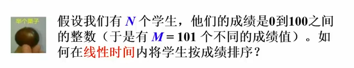
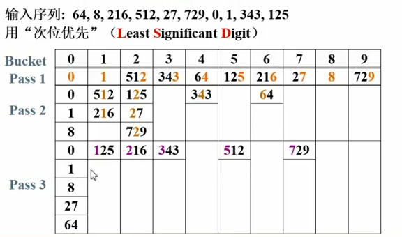

# 基数排序

前面的算法基于比较两个数大小

### 
桶排序



```c
void Bucket_Sort(ElementType A[], int N)
{
  count[]初始化;
  while(读入一个学生的成绩grade)
    将该学生插入count[grade]链表;
  for(int i=0; i < M; i++)
  {
    if(count[i])
      输出整个count[i]链表;  
  } 
}                                                                                                                     
```


$T(N, M) = O(M+N)$

如果M>>N这么办？


**次位优先** Least Significant Digit LSD

先比较个位数，再比较十位数... 




$T=O(P(N+B))$


**多关键字的排序** 

扑克牌排序：花色是主关键字(高位)，面值是次关键字(个位)

**主位优先** Most Significant Digit


