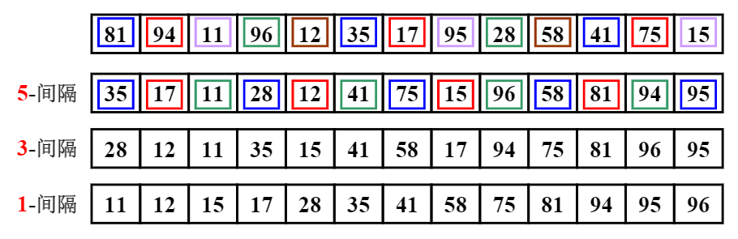
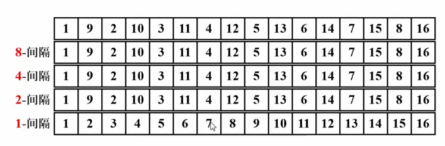

# 希尔排序

希尔排序Shell Sort



定义增量序列 $D_M>D_{M-1}>...>D_1=1$

对每一个增量 $D_k$进行“ $D_k$间隔”排序


对每个“ $D_k$间隔”的有序序列，在执行 $D_{k-1}$-间隔排序后，仍然是“ $D_k$间隔”有序的


### 希尔增量排序

原始希尔排序： $D_M=[N/2]\ , D_k=[D_{k+1}/2]$

```c
void Shell_sort(ElementType A[], int N)
{
  for(D=N/2; D>0; D/=2)
  {
    for(P=D; P<N; P++)
    {
      Tmp = A[P];
      for(i=P; i>=D && A[i-D]>Tmp; i-=D)
        A[i] = A[i-D];
      A[i] = Tmp;
    }
  }
}
```


最坏情况： $T = \Theta(N^2)$



增量元素不互质，小增量根本不起作用！


Hibbard增量序列： $D_k=2^k-1$增量元素互质

最坏情况： $T = \Theta(N^{3/2})$

猜想：$T_{avg} = \Theta(N^{5/4})$


Sedgewich增量序列：{1，5，19，41，109，...}


