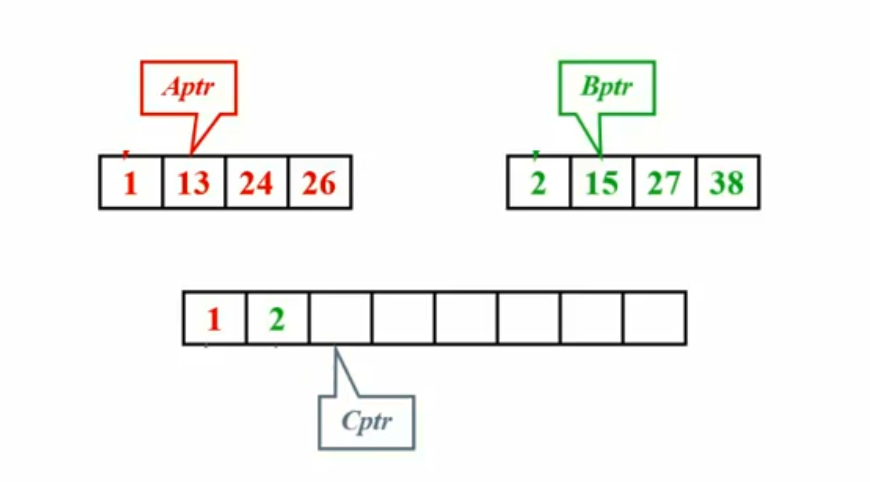
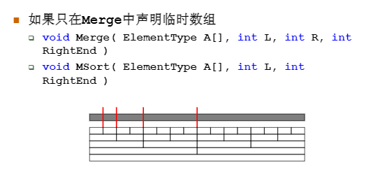
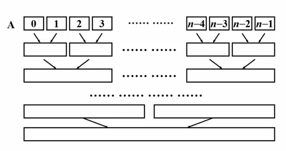

# 归并排序

### 两个有序子列的归并

类似多项式的加法

三个指针（位置，不是语法中的指针）



两个子列一共有N个元素，则归并的时间复杂度是T=O(N)

```c
void Merge(ElementType A[], ElementType TmpA[], int L, int R, int RightEnd)
{
  // L=左边起始位置 R=右边起始位置 RightEnd=右边终点位置 
  LeftEnd = R - 1; // 左边终点位置，假设左右两边挨着 
  Tmp = L; // 存放结果数组的初始位置 
  NumElements = RightEnd - L + 1;
  while(L <= LeftEnd && R <= RightEnd)
  {
    if(A[L] <= A[R])
      TmpA[Tmp++] = A[L++];
    else
      TmpA[Tmp++] = A[R++];
  }
  while(L <= LeftEnd) // 直接复制左边剩下的 
    TmpA[Tmp++] = A[R++];
  while(R <= RightEnd) // 直接复制右边剩下的 
    TmpA[Tmp++] = A[R++];
  for(int i = 0; i < NumElements; i++, RightEnd--)
    A[RightEnd] = TmpA[RightEnd]; 
}
```


### 递归算法

分而治之

```c
void MSort(ElementType A[], ElementType TmpA[], int L, int RightEnd)
{
  int Center;
  if(L < RightEnd)
  {
    Center = (L + RightEnd) / 2;
    MSort(A, TmpA, L, Center);
    MSort(A, TmpA, Center+1, RightEnd);
    Merge(A, TmpA, L, Center+1, RightEnd);
  }
} 
```


复杂度  $T=O(NlogN)$

稳定不能


统一函数接口

```c
void Merge_Sort(ElementType A[], int N)
{
  ElementType * TmpA;
  TmpA = malloc(N*sizeof(ElementType));
  if(TmpA != NULL)
  {
    MSort(A, TmpA, 0, N-1);
    free(TmpA);
  }
  else  Error("No Space!");
}  
```




额外空间复杂度多

### 非递归算法



```c
void Merge_pass(ElementType A[], ElementType Tmp[], int N, int length)
{
  for(int i = 0; i <= N-2*length; i += 2*length)
    Merge1(A, TmpA, i, i+length, i+2*length-1);
  if(i+length < N)
    Merge1(A, TmpA, i+length, N-1);
  else
    for(j = i; j < N; j++)
      TmpA[j] = A[j];
}
```


```c
void Merge_sort(ElementType A[], int N)
{
  ElementType * TmpA;
  TmpA = malloc(N*sizeof(ElementType));
  if(TmpA != NULL)
  {
    while(length < N)
    {
      Merge_pass(A, TmpA, N, length);
      length *= 2;
      Merge_pass(TmpA, A, N, length);
      length *= 2;
    }
    free(TmpA);
  }
  else ERROR("空间不足");
}
```


