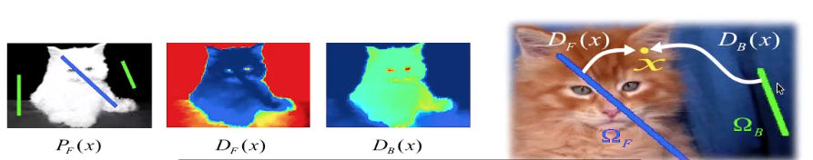
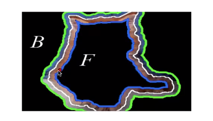
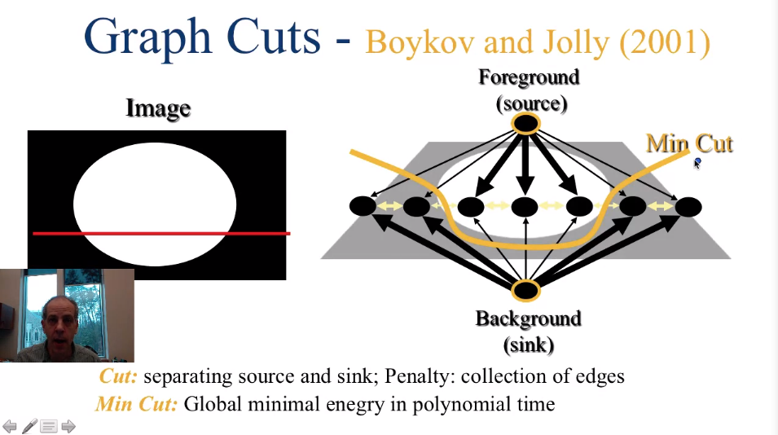

### Image Segmentation

#### Edges and regions

梯度$\nabla I = <\frac{\partial I}{\partial x},\frac{\partial I}{\partial y}>$ 离散化计算

梯度很小怎么办

#### Hough Transform

边缘检测

如何检测直线？

$\rho=xcos\theta+ysin\theta$
每个直线对应一组$(\rho, \theta)$

图像的坐标系映射到新的$\rho, \theta$坐标系，离散化，确定x,y，在新的坐标系中画出正弦曲线，交点，找到最值

如何检测环形？
$(x-x_0)^2+(y-y_0)^2=r^2$

#### Otsu's Image Segmentation Algorithm

找到中间分割直方图的阈值
类似二值的直方图，双峰分布

最小化加权类内方差

$\sigma_w^2(t)=q_1(t)\sigma_1^2(t)+q_2(t)\sigma_2^2(t)$
$q_1(t)=\displaystyle \sum_{i=1}^t P(i)$第一类的概率
$q_2(t)=\displaystyle \sum_{i=t+1}^I P(i)$第二类的概率

$\mu_1(t)=\displaystyle\sum_{i=1}^t\displaystyle\frac{iP(i)}{q_1(t)}$第一类均值
$\mu_2(t)=\displaystyle\sum_{i=t+1}^I\displaystyle\frac{iP(i)}{q_1(t)}$第二类均值

$\sigma_1^2(t)=\displaystyle\sum_{i=1}^t[i-\mu_1(t)]^2\displaystyle\frac{P(i)}{q_1(t)}$第一类方差

$\sigma_2^2(t)=\displaystyle\sum_{i=t+1}^[i-\mu_2(t)]^2\displaystyle\frac{P(i)}{q_2(t)}$第二类方差

总方差$\sigma^2=\sigma_w^2(t)+q_1(t)[1-q_1(t)][\mu_1(t)-\mu_2(t)]^2$within class + between class

背景不是纯色没办法用otsu算法

解决办法：分块

#### Interactive Image Segmentation

**Step1-Feature Distribution Estimation**

Estimate the color distribution on scribbles

Each pixel is assigned a probability to belong to F or B
用户涂抹，标记为前景的相似的像素应该为前景，标记为背景的相似的像素应该为背景

背景的变化一般比较小

$P_F(x)=\displaystyle\frac{P_r(\vec{c_x}|F)}{P_r(\vec{c_x}|F)+P_r(\vec{c_x}|B)}$

**Step2 Weighted Distance Transform**

做前景和做背景的概率相比较
比较最短路线的长度
测地线？geodesic

$d(s_1,s_2):=\underset{C_{s_1,s_2}}{min}\displaystyle \int_{C_{s1,s2}}Wds$

$W:=|\nabla P_F(x)\cdot\vec{C'_{s_1,s_2}(x)}|\\
D_l(x):=\underset{s \in \Omega_l}{min}\ d(s,x),l\in\{F,B\}$
比较$D_F(x)$和$D_B(x)$

**Step3 Refine**

自动缩小边界，或者扩大边界，进行局部计算，让边界更精确

#### Graph Cuts
倾斜图像
中间取一条线
两个节点(sink->background source->foreground)
连线
根据概率决定权重
相邻像素点之间同样连接
权重？使得相似的像素点处在同一边

同梯度/差成正比

Min Cut试图切断弱相连的边(Global minimal energy in polynomial time)

#### Mumford-Shah Image Segmentation

用一致或者平滑过渡的灰度值填充每个分割段

处理结果和原图之间相差的约束（e.g.均方误差）
分割边缘数的约束
折衷

之后再讨论

#### Active Contours(snakes)

思路：从一个曲线开始，曲线移动，到边缘为止

#### Roto Brush(Adobe AfterEffects)

video segmentation