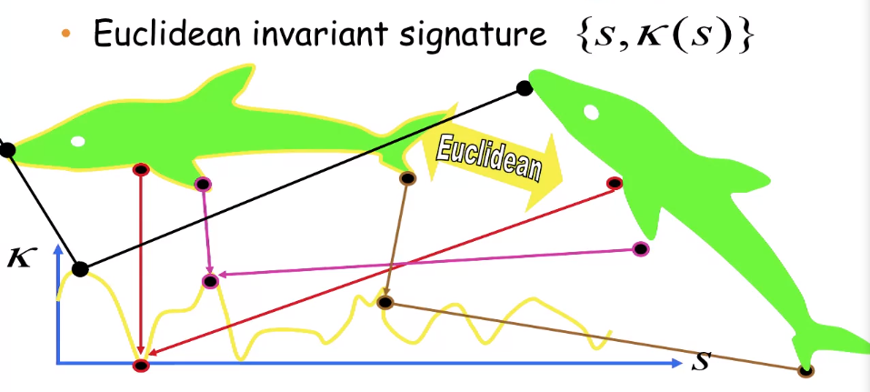
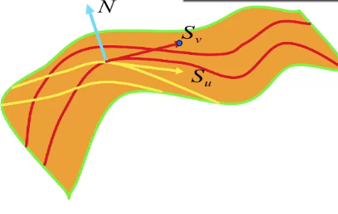
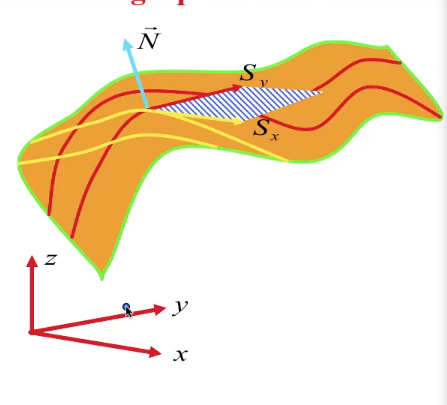

### Partial Differential Equations in Image Processing

经典的图像处理基于离散形式

Sum instead of integrals
Re-definition of classical continuous operators, such as gradients, Laplacian, etc

**the PDE approach**
连续域
图像是迭代的结果：PDEs
数值分析：如何实现连续域的数学工具

Accuracy
Formal analysis(形式分析)

#### Planar Differential Geometry
曲线上的平面理解

$C(p)=\{x(p), y(p)\}, p \in [0,1]$
闭合曲线

切线$\vec{t}=\frac{C_p}{|C_p|}=C_s$单位长度 微分方程 $C_p=\frac{\partial C}{\partial p}=[X_p, y_p]$
法线$C_{ss}=\kappa\vec{n}$ 二阶导数

曲率 Curvature 二阶导数的模

**Linear Transformations**
仿射变换 Affine $\{\widetilde{x}, \widetilde{y}\}^{T}= A\{x, y\}^T + \overline{b}$

欧几里得变换（旋转和平移） Euclidean $A=[\overline{u_1}, \overline{u_2}]， where<\overline{u_1}, \overline{u_2}>=0，<\overline{u_i}, \overline{u_ii}>=1$正交矩阵，内积为0，单位向量

仿射运动 Equi-Affine $\{\widetilde{x}, \widetilde{y}\}^{T}= A\{x, y\}^T + \overline{b}, det(A)=1$ 行列式为1

Euclidean invariant signature $\{s, \kappa(s)\}$

欧几里得变换 曲率不变（一阶导数和二阶导数都不变）

Cartan Theorem

欧几里得变换

只做平移和旋转，函数是不会变的

微风不变性

仿射变换？

$I_2(x,y)=I_1(T_1(x,y), T_2(x,y))$

$\begin{pmatrix}
    T_1(x,y)\\
    T_2(x,y)
\end{pmatrix}=
\begin{pmatrix}
     a&b\\
    c&d
\end{pmatrix}
\begin{pmatrix}
   x\\y
\end{pmatrix}+
\begin{pmatrix}
    e\\f
\end{pmatrix}$

Equi-Affine: $det\begin{pmatrix}
     a&b\\
     c&d
\end{pmatrix}=1$

参数化：$C(p), C(r)$不同的参数得到的曲线是一样的 invariant
$w = \displaystyle \int F(C,C_p,C_pp,\cdots)dp= \displaystyle \int F(C,C_r,C_rr,\cdots)dr$

**Euclidean arclength**

Length

$ds=\sqrt{dx^2+dy^2}=\frac{dp}{dp}\sqrt{dx^2+dy^2}=dp\sqrt{{\frac{dx}{dp}}^2+{\frac{dy}{dp}}^2}=|C_p|dp$
$s = \displaystyle\int |C_p|dp\\
|C_s|=1$
$Length L= \displaystyle \int_0^1|C_p|dp=\displaystyle \int_0^1<C_p, C_p>^{1/2}dp=\displaystyle\int _0^L ds$

**Equi-Affine arclength**

Area

$(C_v, C_{vv})=1\; 二阶矩阵\\
v=\displaystyle \int (C_p, C_pp)^(1/3)dp\\
v=\displaystyle \int (C_s, C_{ss})^(1/3)ds=\displaystyle \int \kappa^{1/3}ds\\
dv=\kappa^{1/3}ds$

曲率
利用$(C_v, C_{vv})=1$两边同时对v求导
$\frac{d}{dv}(C_v, C_{vv})=0\\
(C_v, C_{vv})+(C_v, C_{vvv})=0\\
(C_v, C_{vvv})v=0$
$C_v //C_{vvv}\\
C_{vvv}=\mu C_v$
$\mu$是仿射曲率

#### Surface Differential Geometry

$S(n,v)=\{x(u,v),y(u,v),z(u,v)\}$

Normal $\vec{N}=\displaystyle \frac{S_u \times S_v}{|S_u \times S_v|}$

Area element $dA=|S_u \times S_v|$

Total area $A=\displaystyle \iint |S_u \times S_v|dudv$

参数表达式
$S:\mathbb{R}^2 \rightarrow \mathbb{R}^3 $

$S(u,v)=\{x=u, y=v, z(u,v)\}$

Normal Curvature
$\kappa_n=<C_{ss}, \vec{N}>$

Principle Curvatures
$\kappa_1=max_\theta(\kappa)$
$\kappa_2=min_\theta(\kappa)$

Mean Curvature $H=\displaystyle\frac{\kappa_1+\kappa_2}{2}$
Gaussian Curvature $K=\kappa_1\kappa_2$