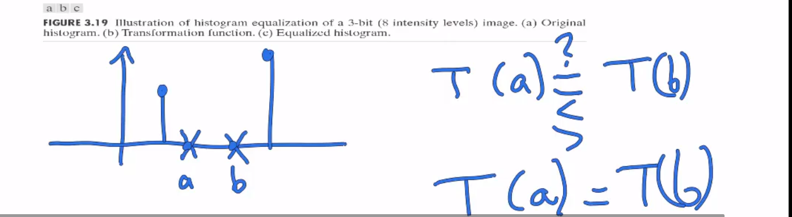
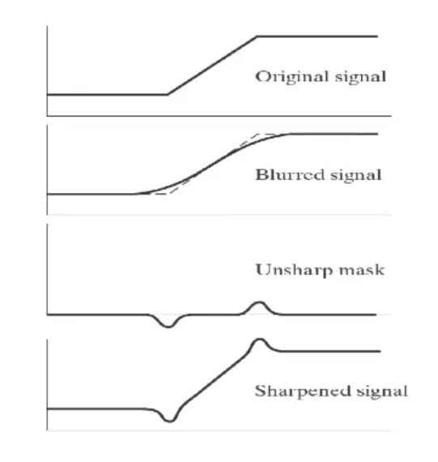

### Image enhancement

#### Histogram operation

Intensity Transformation & Spatial Filtering

e.g.

$ s=r\\
s=clog(r+1)\\
s=f(r)\\
s=L-r(反转)\\
s=Cr^{\gamma}(显示器伽马校正)
$

#### Histogram Equalization

分布 -> 均匀分布

分布 $P_s(s)=P_r(r)|\displaystyle\frac{\partial r}{\partial s}|$

映射 $S=T(r)=(L-1)\displaystyle \int_{0}^{r}P_r(\omega)d\omega$

$\displaystyle\frac{ds}{dr}=\displaystyle\frac{dT(r)}{dr}=\frac{(L-1)\displaystyle \int_{0}^{r}P_r(\omega)d\omega}{dr}=(L-1)P_r(r)$代入

$P_s(s)=P_r(r)|\displaystyle\frac{\partial r}{\partial s}|=P_r(r)|\displaystyle\frac{1}{(L-1)P_r(r)}|=\displaystyle \frac{1}{L-1}$

需要取整

不一定是严格单调递增的但一定是单调递增的

#### Histogram Matching

两次Histogram Equalization

#### Local neighborhood operation
局部平均处理
模糊
函数图像变平滑
局部滤波器
#### Mathematical properties of averaging

local averaging滤波

averaging, gaussian filtering, heat flow

$\displaystyle \sum_i (a-a_i)^2$最小值，结果是$a= \bar{a_i}$

卷积 convolution

$f(x,y,\sigma)=f(x,y) * G(0, \sigma)$

类似heat flow,拉普拉斯算子
$\displaystyle\frac{df}{dt}=\Delta f=\displaystyle\frac{d^2f}{dx^2}+\displaystyle\frac{d^2f}{dy^2}$

#### Non-local Means

a smarter average

相似的局部领域放在一起平均
$p_1=p_0+n_1(noise)\\
p_2=p_0+n_2(noise)\\
\cdots\\
p_N=p_0+n_N(noise)$
取平均
噪声以$N^2$下降

先找相似的邻域，然后取平均

#### Median filter

中值滤波

salt and pepper noise

中值滤波器
不是直接取平均，找到方阵中的中位数，然后全部替换

均值滤波$\displaystyle \sum_i (a-a_i)^2$
鲁棒性不强

中值滤波$\displaystyle \sum |a-a_i|$
鲁棒性比均值强

没有新的数值出现，只有像素原来有的值

#### Derivatives, Laplacian & Unsharp masking
如何在计算机上求导，连续$\rightarrow$离散
$\displaystyle\frac{\partial F}{\partial x}=f(x+1)-f(x)$ 

$\displaystyle\frac{\partial ^{2}f }{\partial x^2}=f(x+1)+f(x-1)-2f(x)$

掩模

$\displaystyle\frac{\partial ^{2}f }{\partial x^2}+\displaystyle\frac{\partial ^{2}f }{\partial y^2}=\Delta f=f(x+1)+f(x-1)-2f(x)+f(y+1)+f(y-1)-2f(y)$

锐化：拉普拉斯算子 原图叠加

Sobel Edges索贝尔算子 边缘检测
反锐化掩模 Unsharp masking

#### Gradients of scalar and vector images

Edge Detection and Color Edge Detection

梯度 是个向量
$\nabla f(x,y)=(\displaystyle\frac{\partial f}{\partial x},\displaystyle\frac{\partial f}{\partial y})$

导数可以用来检测边缘（图像的变化）
梯度是图像变化最大的方向

$|\nabla f|=\sqrt{(\displaystyle\frac{\partial f}{\partial x})^2+(\displaystyle\frac{\partial f}{\partial y})^2}$

色边缘检测
$(R,G,B)$