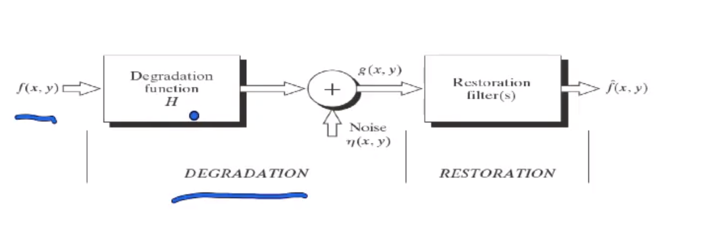
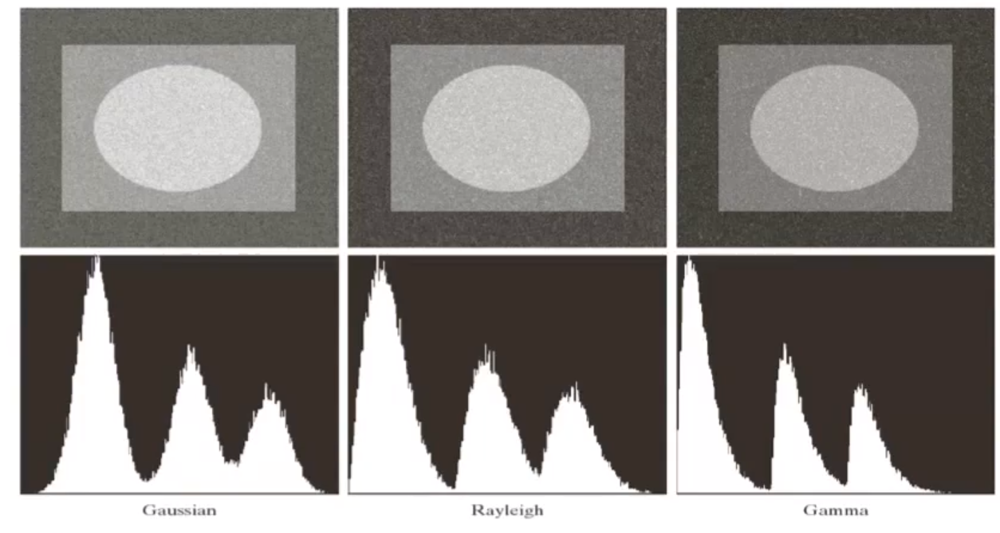

### Image restoration 图像复原

#### What is image restoration

Degradation:增加Noise

Restoration:消去noise

$g(x,y)=f(x,y)*H(x,y)+\eta(x,y)$ 加性噪声

乘性噪声转化成加性噪声 $log$

#### Noise type

possibility

**Gaussian Noise**
$p(z)=\frac{1}{\sqrt{2\pi}\sigma}e^\frac{-(z-\bar z)^2}{2\sigma^2}$

实际情况中不可能存在，数学上容易操作

**Rayleigh Noise**

实际系统中可能出现:磁共振 水下成像

$p(z)=\begin{cases}
\displaystyle \frac{2}{b}(z-a)e^{\frac{-(z-a)^2}{b}}, z\geq a;\\
0, z\leq a.
\end{cases}$

$\bar z=a+\sqrt{\frac{\pi b}{4}}\\
\sigma ^2=\displaystyle \frac{b(4-\pi)}{4}$

**Exponential noise**

$p(z)=\begin{cases}
    ae^{-az}, z \geq 0;\\
    0, z<0.
\end{cases}$

$
\bar z = \displaystyle \frac{1}{a}\\
\sigma ^2 = \displaystyle \frac{1}{a^2}$

**Uniform noise**

$p(z)=\begin{cases}
    \displaystyle \frac{1}{b -a}, a \leq z \leq b;\\
    0, other.
\end{cases}$

$
\bar z = \displaystyle \frac{a+b}{2}\\
\sigma ^2 = \displaystyle \frac{(b-a)^2}{12}$

**Impulse noise**
salt and pepper noise

#### Noise and histogram

#### Estimating noise

#### Degradation function 

$g(x,y)=f(x,y)*H(x,y)+\eta(x,y)$ 

blurring function $H$
$G(u,v)=F(u,v)\cdot H(u,v)$

$F(u,v)=\displaystyle \frac{G(u,v)}{H(u,v)}$ 逆滤波
不能保证H永远非零

blurring
$g(x,y)=f(x,y)*G(0,\sigma)$

Motion blurring

$g(x,y)=\displaystyle \int_0^T f(x-x(t), y-y(t))dt$

#### Wiener Filtering
最小化MSE
$e^2=E[(f(x,y)-\hat f(x,y))^2]$

$\hat F(u,v)=\displaystyle \frac{H^*(u,v)}{H^2(u,v)+\displaystyle \frac{S_\eta}{S_f}}G(u,v)$

复共轭 能量谱 
$\displaystyle \frac{S_\eta}{S_f}=K$ 可以用常数代替